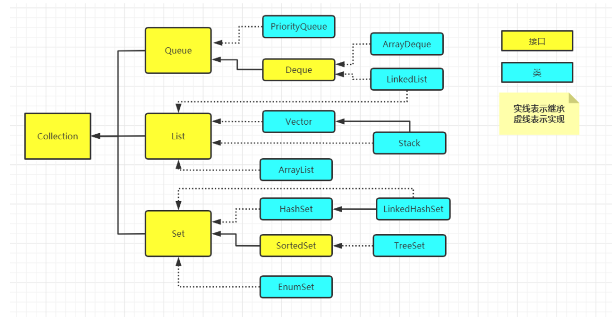
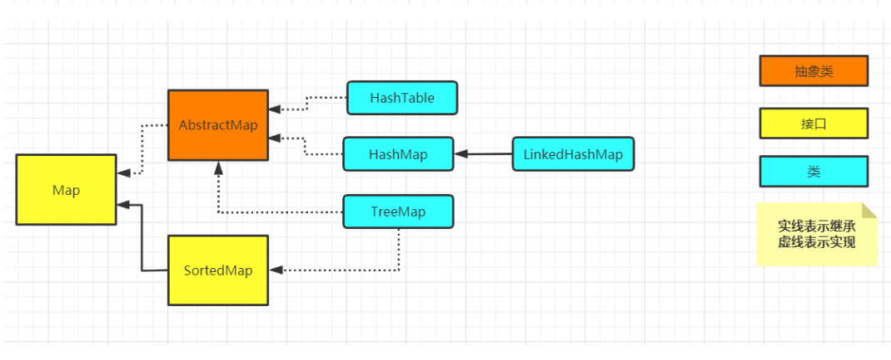
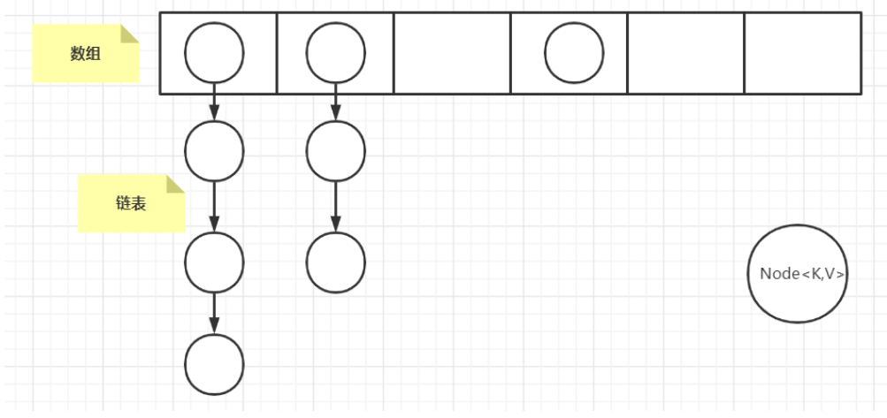
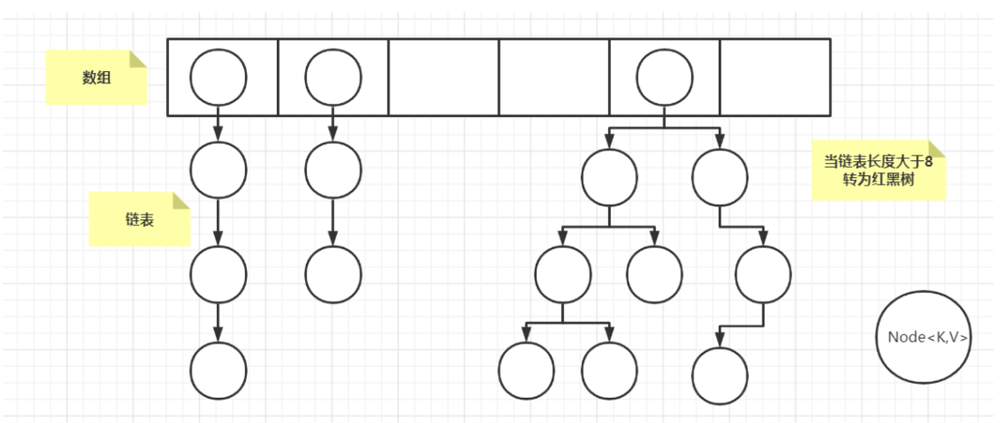
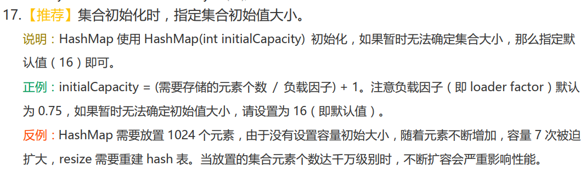
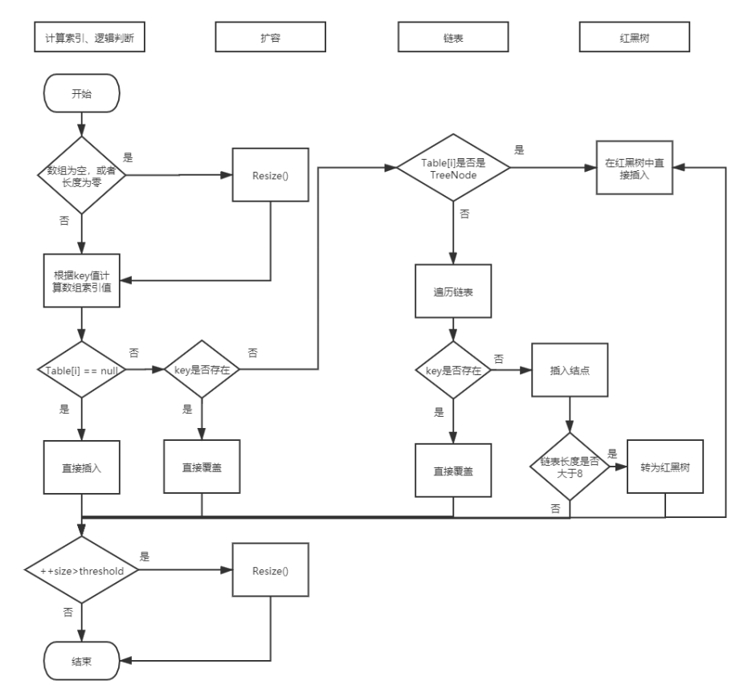
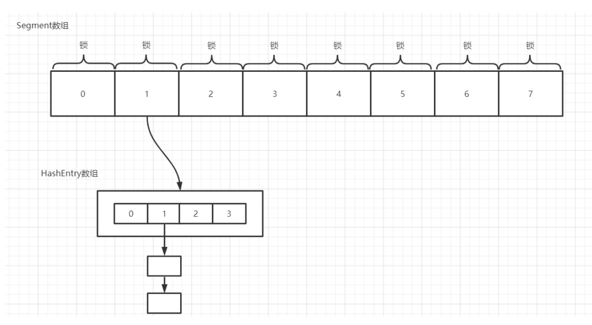
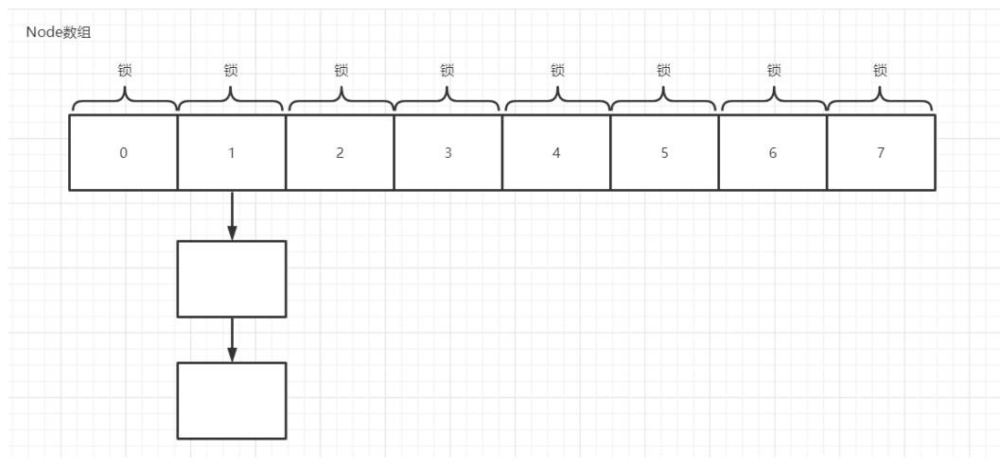
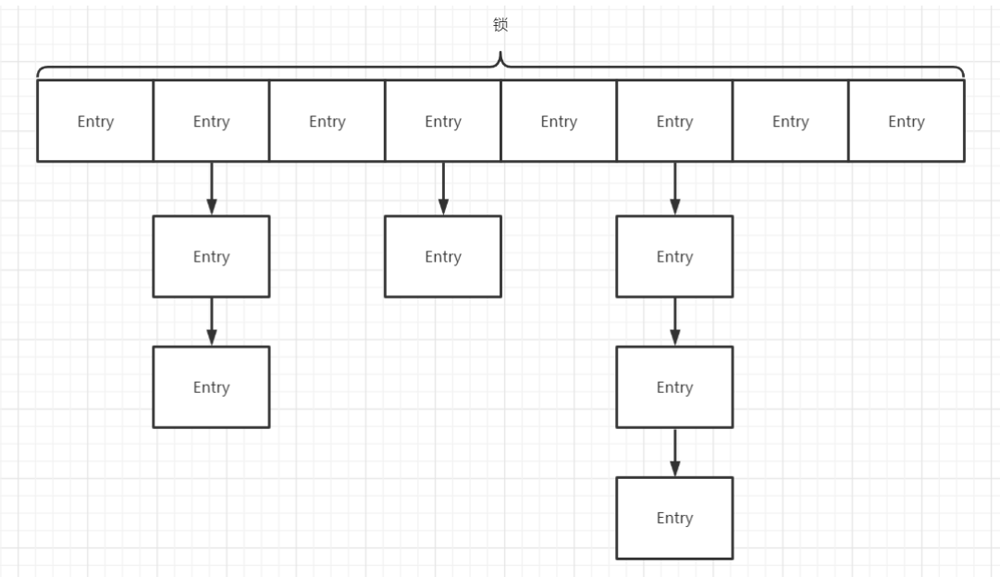

# Java集合

## 常用的集合类有哪些？　＊＊＊

Map接口和Collection接口是所有集合框架的父接口。下图中的实线和虚线看着有些乱，其中接口与接口之间如果有联系为继承关系，类与类之间如果有联系为继承关系，类与接口之间则是类实现接口。重点掌握的抽象类有 HashMap ， LinkedList ， HashTable ， ArrayList ， HashSet ， Stack ，TreeSet ， TreeMap 。注意： Collection 接口不是 Map 的父接口





## List，Set，Map三者的区别？ ＊＊＊

* List ：有序集合（有序指存入的顺序和取出的顺序相同，不是按照元素的某些特性排序），可存储重复元素，可存储多个 null 。
* Set ：无序集合（元素存入和取出顺序不一定相同），不可存储重复元素，只能存储一个 null 。
* Map ：使用键值对的方式对元素进行存储， key 是无序的，且是唯一的。 value 值不唯一。不同的 key 值可以对应相同的 value 值。

## 常用集合框架底层数据结构　＊＊＊

* List：

  1. ArrayList ：数组
  2. LinkedList ：双向链表
* Set ：

  1. HashSet ：底层基于 HashMap 实现， HashSet 存入读取元素的方式和 HashMap 中的 Key 是一致的。
  2. TreeSet ：红黑树
* Map ：

  1. HashMap ： JDK1.8之前 HashMap 由数组+链表组成的， JDK1.8之后有数组+链表/红黑树组成，当链表长度大于8时，链表转化为红黑树，当长度小于6时，从红黑树转化为链表。这样做的目的是能提高 HashMap 的性能，因为红黑树的查找元素的时间复杂度远小于链表。
  2. HashTable ：数组+链表
  3. TreeMap ：红黑树

## 哪些集合类是线程安全的？　＊＊＊

- Vector ：相当于有同步机制的 ArrayList
- Stack ：栈
- HashTable
- enumeration ：枚举

## 迭代器 Iterator 是什么　＊

Iterator 是 Java 迭代器最简单的实现，它不是一个集合，它是一种用于访问集合的方法， Iterator接口提供遍历任何 Collection 的接口。

## Java集合的快速失败机制 “fail-fast”和安全失败机制“fail-safe”是什么？　***

> 快速失败

Java的快速失败机制是Java集合框架中的一种错误检测机制，当多个线程同时对集合中的内容进行修改时可能就会抛出 ~~ConcurrentModificationException~~ 异常。其实不仅仅是在多线程状态下，在单线程中用增强 for 循环中一边遍历集合一边修改集合的元素也会抛出 ~~ConcurrentModificationException~~ 异常。看下面代码

```java
public class Main{
    public static void main(String[] args) {
        List<Integer> list = new ArrayList<>();
        for(Integer i : list){
            list.remove(i); 
            // 运行时抛出ConcurrentModificationException异常
        }
    }
}
```

正确的做法是用迭代器的 `remove()` 方法，便可正常运行

```java
public class Main{
    public static void main(String[] args) {
        List<Integer> list = new ArrayList<>();
        Iterator<Integer> it = list.iterator();
        while(it.hasNext()){
            it.remove();
        }
    }
}
```

造成这种情况的原因是什么？细心的同学可能已经发现两次调用的 `remove()` 方法不同，一个带参数，一个不带参数，这个后面再说，经过查看 ArrayList 源码，找到了抛出异常的代码

```java
final void checkForComodification() {
    if (modCount != expectedModCount)
        throw new ConcurrentModificationException();
}
```

从上面代码中可以看到如果 ~~modCount~~ 和 ~~expectedModCount~~ 这两个变量不相等就会抛出~~ConcurrentModificationException~~ 异常。那这两个变量又是什么呢？继续看源码

```java
protected transient int modCount = 0; //在AbstractList中定义的变量
```

```java
int expectedModCount = modCount;//在ArrayList中的内部类Itr中定义的变量
```

从上面代码可以看到， modCount 初始值为0，而 ~~expectedModCount~~ 初始值等于 ~~modCount~~ 。也就是说在遍历的时候直接调用集合的 `remove()` 方法会导致 ~~modCount~~ 不等于 ~~expectedModCount~~ 进而抛出~~ConcurrentModificationException~~ 异常，而使用迭代器的 `remove()` 方法则不会出现这种问题。那么只能在看看 `remove()` 方法的源码找找原因了

```java
public E remove(int index) {
    rangeCheck(index);
    modCount++;
    E oldValue = elementData(index);
    int numMoved = size - index - 1;
    if (numMoved > 0)
        System.arraycopy(elementData, index+1, elementData, index,
                         numMoved);
    elementData[--size] = null; // clear to let GC do its work
    return oldValue;
}
```

从上面代码中可以看到只有 modCount++ 了，而 expectedModCount 没有操作，当每一次迭代时，迭代器会比较 expectedModCount 和 modCount 的值是否相等，所以在调用 remove() 方法后，modCount 不等于 expectedModCount 了，这时就了报 ConcurrentModificationException 异常。但用迭代器中 remove() 的方法为什么不抛异常呢？原来迭代器调用的 remove() 方法和上面的 remove() 方法**不是同一个**！迭代器调用的 remove() 方法长这样：

```java
public void remove() {
    if (lastRet < 0)
        throw new IllegalStateException();
    checkForComodification();
    try {
        ArrayList.this.remove(lastRet);
        cursor = lastRet;
        lastRet = -1;
        expectedModCount = modCount; 
        // 这行代码保证了 expectedModCount 和 modCount是相等的
    } catch (IndexOutOfBoundsException ex) {
        throw new ConcurrentModificationException();
    }
}
```

从上面代码可以看到 expectedModCount = modCount ，所以迭代器的 remove() 方法保证了 expectedModCount 和 modCount 是相等的，进而保证了在增强 for 循环中修改集合内容不会报 ~~ConcurrentModificationException~~ 异常。

> 上面介绍的只是单线程的情况，用迭代器调用 remove() 方法即可正常运行，但如果是多线程会怎么样呢？

答案是在多线程的情况下即使用了迭代器调用 remove() 方法，还是会报 ~~ConcurrentModificationException~~ 异常。这又是为什么呢？还是要从 ~~expectedModCount~~ 和 ~~modCount~~ 这两个变量入手分析，刚刚说了 ~~modCount~~ 在 ~~AbstractList~~ 类中定义，而 ~~expectedModCount~~ 在 ArrayList 内部类中定义，所以 ~~modCount~~ 是个共享变量而 ~~expectedModCount~~ 是属于线程各自的。简单说，线程1更新了 modCount 和属于自己的 ~~expectedModCount~~ ，而在线程2看来只有 modCount 更新了， expectedModCount 并未更新，所以会抛出 ~~ConcurrentModificationException~~ 异常。

> 简述modCount作用

使用 modCount 属性的集合**无一例外都是线程不安全**的，该属性的意义类似于版本控制。

该属性为迭代器使用时的快速失败，在使用迭代器时检查其他线程是否修改了该集合，在修改前后比较 ~~modCount~~ 是否发生变化，如果发现发生变化，则抛出 ~~ConcurrentModificationException~~ 异常。

使用迭代器修改集合时，会先使 `modCount` +1， 修改结束后，使 `expectedModCount = modCount`来更新版本。

使用 `foreach` 遍历集合时，则是比较遍历前后 `modCount` 是否发生变化

- 安全失败
  采用安全失败机制的集合容器，在遍历时不是直接在集合内容上访问的，而是**先复制原有集合内容，在拷贝的集合上进行遍历**。所以在遍历过程中对原集合所作的修改并不能被迭代器检测到，所以不会抛出 ~~ConcurrentModificationException~~ 异常。**缺点**是迭代器遍历的是开始遍历那一刻拿到的集合拷贝，在遍历期间原集合发生了修改，迭代器是无法访问到修改后的内容。
  ~~java.util.concurrent~~ 包下的容器**都是安全失败**，可以在多线程下并发使用。

## 如何边遍历边移除 Collection 中的元素？　＊＊＊

从上文“快速失败机制”可知在遍历集合时如果直接调用 remove() 方法会抛出 ~~ConcurrentModificationException~~ 异常，所以**使用迭代器中调用** `remove()` 方法。

## Array 和 ArrayList 有何区别？　＊＊＊

- Array 可以包含基本类型和对象类型， ArrayList 只能包含对象类型。
- Array 大小是固定的， ArrayList 的大小是动态变化的。( [ArrayList 的扩容](#ArrayList的扩容)是个常见面试题)
- 相比于 Array, ArrayList 有着更多的内置方法，如 `addAll()`, `removeAll()` 。
- 对于基本类型数据， ArrayList 使用自动装箱来减少编码工作量；而当处理固定大小的基本数据类型的时候，这种方式相对比较慢，这时候应该使用 Array 。

## comparable 和 comparator的区别？　**　

* comparable 接口出自 ~~java.lang~~ 包，可以理解为一个内比较器，因为实现了 Comparable 接口的类可以和自己比较，要和其他实现了 ~~Comparable~~ 接口类比较，可以使用 `compareTo(Object obj)` 方法。 compareTo 方法的返回值是 int ，有三种情况：

1. 返回正整数（比较者大于被比较者）
2. 返回 0（比较者等于被比较者）
3. 返回负整数（比较者小于被比较者）

* comparator 接口出自 ~~java.util~~ 包，它有一个 `compare(Object obj1, Object obj2)` 方法用来排序，返回值同样是 int ，有三种情况，和 compareTo 类似。

它们之间的区别：很多包装类都实现了 comparable 接口，像 Integer 、 String 等，所以直接调用 `Collections.sort()` 直接可以使用。如果对类里面自带的自然排序不满意，而又不能修改其源代码的情况下，使用 Comparator 就比较合适。此外使用 Comparator 可以避免添加额外的代码与我们的目标类耦合，同时可以定义多种排序规则，这一点是 Comparable 接口没法做到的，从灵活性和扩展性讲 Comparator 更优，故在面对**自定义排序的需求**时，可以优先考虑使用 Comparator 接口。

> 自定义排序代码例子

- compare() 返回值
  - 返回值大于0，表示o1大于o2，交换位置。
  - 返回值小于0，表示o1小于o2，位置不变。
  - 返回值等于0，表示两元素相等，不会交换位置。
- 升序：`Arrays.sort(string, Comparator.naturalOrder());`
- 降序：`Arrays.sort(string, Comparator.reverseOrder());`

```java
public static void main(String[] args) {
    Integer[] nums = {5, 3, 6, 2, 7, 1};
	// java 默认升序排序，传入一个 Comparator 后自定义排序方式
    Arrays.sort(nums, new Comparator<Integer>() {
        @Override
        public int compare(Integer o1, Integer o2) {
            // 降序排序
            return o2 - o1;
        }
    });
    // 可用 lambda 表达式 简写
    // Arrays.sort(nums, (o1, o2) -> o2 - o1);

    for (Integer num : nums) {
        System.out.print(num);
    }
}
```

## Collection 和 Collections 有什么区别？　＊＊

- Collection 是一个**集合接口**。它提供了对集合对象进行基本操作的通用接口方法。
- Collections 是一个**包装类**。它包含有各种有关集合操作的**静态多态方法**，例如常用的 `sort()`方法。此类不能实例化，就像一个工具类，服务于Java的 Collection 框架。

## List集合

### 遍历一个 List 有哪些不同的方式？　＊＊

先说一下常见的元素在内存中的存储方式，主要有两种：

1. 顺序存储（Random Access）：相邻的数据元素在内存中的位置也是相邻的，可以根据元素的位置（如 ArrayList 中的下表）读取元素。
2. 链式存储（Sequential Access）：每个数据元素包含它下一个元素的内存地址，在内存中不要求相邻。例如 LinkedList 。

> 主要的遍历方式主要有三种

1. for 循环遍历：遍历者自己在集合外部维护一个计数器，依次读取每一个位置的元素。
2. Iterator 遍历：基于顺序存储集合的 Iterator 可以直接按位置访问数据。基于链式存储集合的 Iterator ，需要保存当前遍历的位置，然后根据当前位置来向前或者向后移动指针。
3. foreach 遍历： foreach 内部也是采用了 Iterator 的方式实现，但使用时不需要显示地声明 Iterator 。

> 那么对于以上三种遍历方式应该如何选取呢？

在Java集合框架中，提供了一个 `RandomAccess` 接口，该接口没有方法，只是一个标记。通常用来标记List 的实现是否支持 RandomAccess 。所以在遍历时，可以先判断是否支持 RandomAccess （ list instanceof RandomAccess ），如果支持可用 for 循环遍历，否则建议用 Iterator 或 foreach 遍历。

### <span id='ArrayList的扩容'>ArrayList的扩容机制***</span>

> 先说下结论，一般面试时需要记住， ArrayList 的初始容量为10，扩容时对是旧的容量值加上旧的容量数值进行右移一位（位运算，相当于除以2，位运算的效率更高），所以每次扩容都是旧的容量的1.5倍。

> 扩容因子为什么是1.5？

扩容因子最好在 (1,2)  这个范围内

如果像Vector那样扩容因子是2的话，那么每次新申请的内存空间正好大于之前分配的空间总和，如 1 + 2 < 4 ...那么这样对缓存申请不够友好，不能复用之前使用过的内存空间，每次必须新开辟一段连续空间。

如果是 1.5 的话，经过几次扩容后，可以复用之前使用过的一段空间。同时 1.5 倍可以结合位运算提高效率。

具体的实现可查看 ArrayList 的源码。

```java
private void grow(int minCapacity) {
    // overflow-conscious code
    int oldCapacity = elementData.length;
    int newCapacity = oldCapacity + (oldCapacity >> 1);
    if (newCapacity - minCapacity < 0)
        newCapacity = minCapacity;
    if (newCapacity - MAX_ARRAY_SIZE > 0)
        newCapacity = hugeCapacity(minCapacity);
    // minCapacity is usually close to size, so this is a win:
    elementData = Arrays.copyOf(elementData, newCapacity);
}
```

### ArrayList 和 LinkedList 的区别是什么？　＊＊＊

- 是否线程安全： ArrayList 和 LinkedList 都是不保证线程安全的

- 底层实现： ArrayList 的底层实现是数组， LinkedList 的底层是双向链表。

- 内存占用： ArrayList 会存在一定的空间浪费，因为每次扩容都是之前的1.5倍，而 LinkedList 中的每个元素要存放直接后继和直接前驱以及数据，所以对于每个元素的存储都要比 ArrayList 花费更多的空间。

- 应用场景： ArrayList 的底层数据结构是数组，所以在插入和删除元素时的时间复杂度都会受到位置的影响，平均时间复杂度为o(n)，在读取元素的时候可以根据下标直接查找到元素，不受位置的影响，平均时间复杂度为o(1)，所以 ArrayList 更加适用于**多读，少增删**的场景。

  LinkedList 的底层数据结构是双向链表，所以插入和删除元素不受位置的影响，平均时间复杂度为o(1)，如果是在指定位置插入则是o(n)，因为在插入之前需要先找到该位置，读取元素的平均时间复杂度为o(n)。所以 LinkedList 更加适用于**多增删，少读写**的场景。

### ArrayList 和 Vector 的区别是什么？　＊＊＊

> 相同点

1. 都实现了 List 接口
2. 底层数据结构都是数组

> 不同点

1. 线程安全： Vector 使用了 Synchronized 来实现线程同步，所以是线程安全的，而 ArrayList 是**线程不安全的**。
2. 性能：由于 Vector 使用了 Synchronized 进行加锁，所以性能不如 ArrayList 。
3. 扩容： ArrayList 和 Vector 都会根据需要动态的调整容量，但是 ArrayList 每次扩容为旧容量的1.5倍，而 Vector 每次扩容为旧容量的2倍。

### 简述 ArrayList、Vector、LinkedList 的存储性能和特性？＊＊＊

- ArrayList 底层数据结构为数组，对元素的读取速度快，而增删数据慢，线程不安全。
- LinkedList 底层为双向链表，对元素的增删数据快，读取慢，线程不安全。
- Vector 的底层数据结构为数组，用 Synchronized 来保证线程安全，性能较差，但线程安全。

### 为什么弃用 Vector

> Vector是JDK1.0中给出的类

1. 因为Vector给**每个**可能出现线程安全的**方法**上加了~~synchronized~~关键字，所以效率低。（ps:**然而这样并没有很好的解决线程安全问题**，如下：）

在判断是否包含某元素后， 会释放锁，在不包含的情况下，执行add之前，锁很有可能会被抢占。

```java
if (!vector.contains(element)) {
    vector.add(element);  
}
```

2. ~~CopyOnWriteArrayList~~ 在jdk1.5时候加入，提供了更好的解决方式。

### CopyOnWriteArrayList 容器

> 什么是CopyOnWrite容器

  CopyOnWrite容器为 ~~java.util.concurrent~~ 包下为并发操作提供的解决方案，是一个**写时复制**的容器。通俗的理解是**当我们往一个容器添加元素的时候，不直接往当前容器添加，而是先将当前容器进行Copy，复制出一个新的容器，然后新的容器里添加元素，添加完元素之后，再将原容器的引用指向新的容器。**这样做的好处是我们可以对CopyOnWrite容器进行并发的读，而不需要加锁，因为当前容器不会添加任何元素。所以CopyOnWrite容器也是一种读写分离的思想，读和写不同的容器。

#### CopyOnWriteArrayList的实现原理

在使用CopyOnWriteArrayList之前，先阅读其源码了解下它是如何实现的。代码是向CopyOnWriteArrayList中add方法的实现（向CopyOnWriteArrayList里添加元素），可以发现在添加的时候是需要加锁的，否则多线程写的时候会Copy出N个副本出来。

```java
public boolean add(E e) {
    final ReentrantLock lock = this.lock;
    lock.lock();
    try {
        Object[] elements = getArray();
        int len = elements.length;
        Object[] newElements = Arrays.copyOf(elements, len + 1);
        newElements[len] = e;
        setArray(newElements);
        return true;
    } finally {
        lock.unlock();
    }
}
```

可以发现，只在修改时需要加锁，读的时候不需要加锁，如果读的时候有多个线程正在向CopyOnWriteArrayList添加数据，读还是会读到旧的数据，因为开始读的那一刻已经确定了读的对象是旧对象。

> 看一下为什么读的时候不需要加锁

CopyOnWriteArrayList

```java
public boolean contains(Object o) {
    Object[] elements = getArray();
    return indexOf(o, elements, 0, elements.length) >= 0;
}
```

与 ArrayList 做个对比

```java
public boolean contains(Object o) {
    return indexOf(o) >= 0;
}
```

可以发现 ~~CopyOnWriteArrayList~~ 在读取数据时先将原数据拷贝出来了一份，不受其他线程影响。

> 适用场景

　CopyOnWrite并发容器用于读多写少的并发场景。比如白名单，黑名单等场景。

> 缺点

- **内存占用问题**。因为CopyOnWrite的写时复制机制，所以在进行写操作的时候，内存里会同时驻扎两个对象的内存，旧的对象和新写入的对象（注意:在复制的时候只是复制容器里的引用，只是在写的时候会创建新对象添加到新容器里，而旧容器的对象还在使用，所以有两份对象内存）。如果这些对象占用的内存比较大，比如说200M左右，那么再写入100M数据进去，内存就会占用300M，那么这个时候很有可能造成频繁的Young GC和Full GC。

  针对内存占用问题，可以通过压缩容器中的元素的方法来减少大对象的内存消耗，比如，如果元素全是10进制的数字，可以考虑把它压缩成36进制或64进制。或者不使用CopyOnWrite容器，而使用其他的并发容器，如ConcurrentHashMap。

* **数据一致性问题**。CopyOnWrite容器只能保证数据的**最终一致性**，**不能保证数据的实时一致性**。所以如果你希望写入的的数据，马上能读到，请不要使用CopyOnWrite容器。==当执行add或remove操作没完成时，get获取的仍然是旧数组的元素==

## Set集合

### 说一下 HashSet 的实现原理　＊＊＊

HashSet 的底层是 HashMap ，默认构造函数是构建一个初始容量为16，负载因子为0.75 的 HashMap。
HashSet 的值存放于 HashMap 的 key 上， HashMap 的 value 统一为 ~~PRESENT~~ 。

### HashSet如何检查重复？（HashSet是如何保证数据不可重复的？）***

这里面涉及到了 HasCode() 和 equals() 两个方法。

* equals()
  先看下 String 类中重写的 equals 方法。

  ```java
  public boolean equals(Object anObject) {
      if (this == anObject) {
          return true;
      } 
      if (anObject instanceof String) {
          String anotherString = (String) anObject;
          int n = value.length;
          if (n == anotherString.value.length) {
              char v1[] = value;
              char v2[] = anotherString.value;
              int i = 0;
              while (n-- != 0) {
                  if (v1[i] != v2[i])
                      return false;
                  i++;
              } 
              return true;
          }
      } 
      return false;
  }
  ```

  从源码中可以看到：

  1. equals 方法首先比较的是内存地址，如果内存地址相同，直接返回 true ；如果内存地址不同，再比较对象的类型，类型不同直接返回 false ；类型相同，再比较值是否相同；值相同返回 true ，值不同返回 false 。总结一下， equals 会比较内存地址、对象类型、以及值，内存地址相同， equals 一定返回 true ；对象类型和值相同， equals 方法一定返回 true 。
  2. 如果没有重写 equals 方法，那么 equals 和 == 的作用相同，比较的是对象的地址值

* hashCode

  hashCode 方法返回对象的散列码，返回值是 int 类型的散列码。散列码的作用是确定该对象在哈希表中的索引位置。

  关于 hashCode 有一些约定：

  1. 两个对象相等，则 hashCode 一定相同。
  2. 两个对象有相同的 hashCode 值，它们不一定相等。
  3. hashCode() 方法默认是对堆上的对象产生独特值，如果没有重写 hashCode() 方法，则该类的两个对象的 hashCode 值肯定不同

介绍完equals()方法和hashCode()方法，继续说下HashSet是如何检查重复的。

HashSet 的特点是存储元素时无序且唯一，在向 HashSet 中添加对象时，首先会计算对象的 HashCode值来确定对象的存储位置，如果该位置没有其他对象，直接将该对象添加到该位置；如果该存储位置有存储其他对象（新添加的对象和该存储位置的对象的 HashCode 值相同），调用 equals 方法判断两个对象是否相同，如果相同，则添加对象失败，如果不相同，则会将该对象重新散列到其他位置。

### HashSet与HashMap的区别　＊＊＊

|               HashMap                |                HashSet                 |
| :----------------------------------: | :------------------------------------: |
|           实现了 Map 接口            |            实现了 Set 接口             |
|              存储键值对              |                存储对象                |
|       key 唯一， value 不唯一        |              存储对象唯一              |
| HashMap 使用键（ Key ）计算 Hashcode | HashSet 使用成员对象来计算 hashcode 值 |
|             速度相对较快             |              速度相对较慢              |

## Map集合

### HashMap在JDK1.7和JDK1.8中有哪些不同？HashMap的底层实现　＊＊＊

- JDK1.7的底层数据结构(数组+链表)



- JDK1.8的底层数据结构(数组+链表)



- JDK1.7的Hash函数

```java
static final int hash(int h){
    h ^= (h >>> 20) ^ (h >>>12);
    return h ^ (h >>> 7) ^ (h >>> 4);
}
```

- JDK1.8的Hash函数

  ```java
  static final int hash(Onject key){
      int h;
      return (key == null) ? 0 : (h = key.hashCode()) ^ (h >>> 16);
  }
  ```

JDK1.8的函数经过了一次异或一次位运算一共两次扰动，而JDK1.7经过了四次位运算五次异或一共九次扰动。这里简单解释下JDK1.8的hash函数，面试经常问这个，两次扰动分别是 key.hashCode() 与 key.hashCode() 右移16位进行异或。这样做的目的是，高16位不变，低16位与高16位进行异或操作，进而减少碰撞的发生，高低Bit都参与到Hash的计算。如果不进行扰动处理，因为hash值有32位，直接对数组的长度求余，起作用只是hash值的几个低位。

HashMap在JDK1.7和JDK1.8中有哪些不同点：

|                            | JDK1.7                                                    | JDK1.8                                | JDK1.8的优势                                                 |
| -------------------------- | --------------------------------------------------------- | ------------------------------------- | ------------------------------------------------------------ |
| 底层结构                   | 数组+链表                                                 | 数组+链表/红 黑树(链表大于 8)         | 避免单条链表过长而影响查询效 率，提高查询效率                |
| hash值计 算方式            | 9次扰动 = 4次位运算 + 5 次异或运算                        | 2次扰动 = 1次 位运算 + 1次异 或运算   | 可以均匀地把之前的冲突的节点 分散到新的桶（具体细节见下面 扩容部分） |
| 插入数据 方式              | 头插法（先将原位置的数 据移到后1位，再插入数据 到该位置） | 尾插法（直接 插入到链表尾 部/红黑树） | 解决多线程造成死循环地问题                                   |
| 扩容后存 储位置的 计算方式 | 重新进行hash计算                                          | 原位置或原位置+旧容量                 | 省去了重新计算hash值的时间                                   |

### HashMap 的长度为什么是2的幂次方　＊＊＊

因为 HashMap 是通过 key 的hash值来确定存储的位置，但Hash值的范围是-2147483648到2147483647，不可能建立一个这么大的数组来覆盖所有hash值。所以在计算完hash值后会对数组的长度进行取余操作，如果数组的长度是2的幂次方， `(length - 1) & hash` 等同于 `hash % length` ，可以用 `(length - 1) & hash` 这种位运算来代替%取余的操作进而提高性能。

默认值是 16， 如果指定了一个非 2 的幂次方的数，会变成大于他的最小的2的幂，这个数小于 2 ^ 30

> 阿里巴巴开发规约



### HashMap的put方法的具体流程？　＊＊

HashMap的主要流程可以看下面这个流程图，逻辑非常清晰。



> 判断现有节点和即将put的数据是否相同的过程

1. 判断hash值是否相等，如果hash值不相等，那么说明一定不是同一个对象，如果相同，则继续比较
2. == 比较对象地址
3. equals 方法判断数据值是否相等（没重写则还是判断地址）

### HashMap的扩容操作是怎么实现的？　＊＊＊

- 初始值为16，负载因子为0.75，阈值为 `负载因子*容量`
- resize() 方法是在 hashmap 中的键值对大于阀值时或者初始化时，就调用 resize() 方法进行扩容。
- 每次扩容，容量都是之前的两倍
- 扩容时有个判断 `e.hash & oldCap` 是否为零，也就是相当于hash值对数组长度的取余操作，若等于0，则位置不变，若等于1，位置变为原位置加旧容量。

源码如下：

```java
final Node<K,V>[] resize() {
    Node<K,V>[] oldTab = table;
    int oldCap = (oldTab == null) ? 0 : oldTab.length;
    int oldThr = threshold;
    int newCap, newThr = 0;
    if (oldCap > 0) {
        if (oldCap >= MAXIMUM_CAPACITY) { 
            // 如果旧容量已经超过最大值，阈值为整数最大值
            threshold = Integer.MAX_VALUE;
            return oldTab;
        }else if ((newCap = oldCap << 1) < MAXIMUM_CAPACITY &&
                  oldCap >= DEFAULT_INITIAL_CAPACITY)
            newThr = oldThr << 1; // 没有超过最大值就变为原来的2倍
    } else if (oldThr > 0)
        newCap = oldThr;
    else {
        newCap = DEFAULT_INITIAL_CAPACITY;
        newThr = (int)(DEFAULT_LOAD_FACTOR * DEFAULT_INITIAL_CAPACITY);
    } 
    if (newThr == 0) {
        float ft = (float)newCap * loadFactor;
        newThr = (newCap < MAXIMUM_CAPACITY && ft < (float)MAXIMUM_CAPACITY
                  ? (int)ft : Integer.MAX_VALUE);
    } 
    threshold = newThr;
    @SuppressWarnings({"rawtypes","unchecked"})
    Node<K,V>[] newTab = (Node<K,V>[])new Node[newCap];
    table = newTab;
    if (oldTab != null) {
        for (int j = 0; j < oldCap; ++j) {
            Node<K,V> e;
            if ((e = oldTab[j]) != null) {
                oldTab[j] = null;
                if (e.next == null)
                    newTab[e.hash & (newCap - 1)] = e;
                else if (e instanceof TreeNode)
                    ((TreeNode<K,V>)e).split(this, newTab, j, oldCap);
                else {
                    Node<K,V> loHead = null, loTail = null;
                    // loHead,loTail 代表扩容后在原位置
                    Node<K,V> hiHead = null, hiTail = null;
                    // hiHead,hiTail 代表扩容后在原位置+旧容量
                    Node<K,V> next;
                    do {
                        next = e.next;
                        if ((e.hash & oldCap) == 0) { 
                            // 判断是否为零，为零赋值到 loHead，不为零赋值到hiHead
                            if (loTail == null)
                                loHead = e;
                            else
                                loTail.next = e;
                            loTail = e;
                        } else {
                            if (hiTail == null)
                                hiHead = e;
                            else
                                hiTail.next = e;
                            hiTail = e;
                        }
                    } while ((e = next) != null);
                    if (loTail != null) {
                        loTail.next = null;
                        newTab[j] = loHead; // loHead放在原位置
                    } if (hiTail != null) {
                        hiTail.next = null;
                        newTab[j + oldCap] = hiHead; // hiHead放在原位置+旧容量
                    }
                }
            }
        }
    } 
    return newTab;
}
```

### HashMap默认加载因子为什么选择0.75？

这个主要是考虑空间利用率和查询成本的一个折中。如果加载因子过高，空间利用率提高，但是会使得哈希冲突的概率增加；如果加载因子过低，会频繁扩容，哈希冲突概率降低，但是会使得空间利用率变低。具体为什么是0.75，不是0.74或0.76，这是一个基于数学分析（泊松分布）和行业规定一起得到的一个结论。

### 为什么要将链表中转红黑树的阈值设为8？为什么不一开始直接使用红黑树？

可能有很多人会问，既然红黑树性能这么好，为什么不一开始直接使用红黑树，而是先用链表，链表长度大于8时，才转换为红黑树。

- 因为红黑树的节点所占的空间是普通链表节点的两倍，但查找的时间复杂度低，所以只有当节点特别多时，红黑树的优点才能体现出来。至于为什么是8，是通过数据分析统计出来的一个结果，链表长度到达8的概率是很低的，综合链表和红黑树的性能优缺点考虑将大于8的链表转化为红黑树。
- 链表转化为红黑树除了链表长度大于8，还要 HashMap 中的数组长度大于64。也就是如果 HashMap 长度小于64，链表长度大于8是不会转化为红黑树的，而是直接扩容。

### HashMap是怎么解决哈希冲突的？　＊＊＊

哈希冲突： hashMap 在存储元素时会先计算 key 的hash值来确定存储位置，因为 key 的hash值计算最后有个对数组长度取余的操作，所以即使不同的 key 也可能计算出相同的hash值，这样就引起了hash冲突。 hashMap 的底层结构中的链表/红黑树就是用来解决这个问题的。

HashMap 中的哈希冲突解决方式可以主要从三方面考虑（以JDK1.8为背景）

- 拉链法

  HasMap 中的数据结构为数组+链表/红黑树，当不同的 key 计算出的hash值相同时，就用链表的形式将Node结点（冲突的 key 及 key 对应的 value ）挂在数组后面。

* hash函数
  key 的hash值经过两次扰动， key 的 hashCode 值与 key 的 hashCode 值的右移16位进行异或，然后对数组的长度取余（实际为了提高性能用的是位运算，但目的和取余一样），这样做可以让 hashCode 取值出的高位也参与运算，进一步降低hash冲突的概率，使得数据分布更平均。
* 红黑树
  在拉链法中，如果hash冲突特别严重，则会导致数组上挂的链表长度过长，性能变差，因此在链表长度大于8 且 还要 HashMap 中的数组长度大于64时，将链表转化为红黑树，可以提高遍历链表的速度。

### HashMap为什么不直接使用hashCode()处理后的哈希值直接作为 table 的下标？　***

hashCode() 处理后的哈希值范围太大，不可能在内存建立这么大的数组。

### 能否使用任何类作为 Map 的 key？　***

可以，但要注意以下两点：

- 如果类重写了 equals() 方法，也应该重写 hashCode() 方法。
- 最好定义 key 类是不可变的，这样 key 对应的 hashCode() 值可以被缓存起来，性能更好，这也是为什么String 特别适合作为 HashMap 的 key 。

### 为什么HashMap中String、Integer这样的包装类适合作为Key？***

- 这些包装类都是 final 修饰，是不可变性的， 保证了 key 的不可更改性，不会出现放入和获取时哈希值不同的情况。
- 它们内部已经重写过 hashcode() , equal() 等方法。

### 如果使用Object作为HashMap的Key，应该怎么办呢？　**

- 重写 hashCode() 方法，因为需要计算hash值确定存储位置
- 重写 equals() 方法，因为需要保证 key 的唯一性。

### HashMap 多线程导致死循环问题　***

> 由于JDK1.7的 hashMap 遇到hash冲突采用的是头插法，在多线程情况下会存在死循环问题，但JDK1.8已经改成了尾插法，不存在这个问题了。但需要注意的是JDK1.8中的 HashMap 仍然是不安全的，在多线程情况下使用仍然会出现线程安全问题。基本上面试时说到这里既可以了，具体流程用口述是很难说清的，感兴趣的可以看这篇文章。[HASHMAP的死循环](https://coolshell.cn/articles/9606.html)

### ConcurrentHashMap 底层具体实现知道吗？　**

- JDK1.7
  在JDK1.7中， ~~ConcurrentHashMap~~ 采用 Segment 数组 + HashEntry 数组的方式进行实现。Segment 实现了 ~~ReentrantLock~~ ，所以 Segment 有锁的性质， HashEntry 用于存储键值对。一个 ~~ConcurrentHashMap~~ 包含着一个 Segment 数组，一个 Segment 包含着一个 HashEntry 数组，HashEntry 是一个链表结构，如果要获取 HashEntry 中的元素，要先获得 Segment 的锁。



- JDK1.8
  在JDK1.8中，不在是 Segment + HashEntry 的结构了，而是和 HashMap 类似的结构，Node数组+链表/红黑树，采用 CAS + synchronized 来保证线程安全。当链表长度大于8，链表转化为红黑树。在JDK1.8中 synchronized 只锁链表或红黑树的头节点，是一种相比于 segment 更为细粒度的锁，锁的竞争变小，所以效率更高。



总结一下：

- JDK1.7底层是 ReentrantLock + Segment + HashEntry ，JDK1.8底层是 synchronized + CAS +链表/红黑树
- JDK1.7采用的是分段锁，同时锁住几个 HashEntry ，JDK1.8锁的是Node节点，只要没有发生哈希冲突，就不会产生锁的竞争。JDK1.8相比于JDK1.7提供了一种粒度更小的锁，减少了锁的竞争，提高了 ConcurrentHashMap 的并发能力。

### HashTable的底层实现知道吗？　**

HashTable 的底层数据结构是数组+链表，链表主要是为了解决哈希冲突，并且**整个数组**都是 ~~synchronized~~ 修饰的，所以 HashTable 是线程安全的，但**锁的粒度太大**，锁的竞争非常激烈，效率很低。



### HashMap、ConcurrentHashMap及Hashtable 的区别　＊＊＊

|                                | HashMap(JDK1.8)                    | ConcurrentHashMap(JDK1.8)         | HashTable                        |
| ------------------------------ | ---------------------------------- | --------------------------------- | -------------------------------- |
| 底层实现                       | 数组+链表/红黑树                   | 数组+链表/红黑树                  | 数组+链表                        |
| 线程安全                       | 不安全                             | 安全( Synchronized 修饰Node 节点) | 安全 ( Synchronized 修 饰整个表) |
| 效率                           | 高                                 | 较高                              | 低                               |
| 扩容                           | 初始16，每次扩容成 2n              | 初始16，每次扩容成2n              | 初始11，每次扩容 成2n+1          |
| 是否支持 Null key和 Null Value | 可以有一个Null key，Null Value多个 | 不支持                            | 不支持                           |

### 红黑树原理

#### 性质

**性质一：节点是红色或者是黑色；**

在树里面的节点不是红色的就是黑色的，没有其他颜色，要不怎么叫红黑树呢，是吧。

**性质二：根节点是黑色；**

根节点总是黑色的。它不能为红。

**性质三：每个叶节点（NIL或空节点）是黑色；**

这个可能有点理解困难，可以看图：


这个图片就是一个红黑树，NIL节点是个空节点，并且是黑色的。

**性质四：每个红色节点的两个子节点都是黑色的（也就是说不存在两个连续的红色节点）；**

就是连续的两个节点不能是连续的红色，连续的两个节点的意思就是父节点与子节点不能是连续的红色。

**性质五：从任一节点到其每个叶节点的所有路径都包含相同数目的黑色节点；**

红黑树能够以O(log2 n)  的时间复杂度进行搜索、插入、删除操作。此外，由于它的设计，任何不平衡都会在三次旋转之内解决。当然，还有一些更好的，但实现起来更复杂的数据结构  能够做到一步旋转之内达到平衡，但红黑树能够给我们一个比较“便宜”的解决方案。红黑树的算法时间复杂度和AVL相同，但统计性能比AVL树更高。

红黑树在插入和删除比AVL树高

 \1.  如果插入一个node引起了树的不平衡，AVL和RB-Tree都是最多只需要2次旋转操作，即两者都是O(1)；但是在删除node引起树的不平衡时，最坏情况下，AVL需要维护从被删node到root这条路径上所有node的平衡性，因此需要旋转的量级O(logN)，而RB-Tree最多只需3次旋转，只需要O(1)的复杂度。

\2.  其次，AVL的结构相较RB-Tree来说更为平衡，在插入和删除node更容易引起Tree的unbalance，因此在大量数据需要插入或者删除时，AVL需要rebalance的频率会更高。因此，RB-Tree在需要大量插入和删除node的场景下，效率更高。自然，由于AVL高度平衡，因此AVL的search效率更高。

## Java集合的常用方法　＊＊

> 这些常用方法是需要背下来的，虽然面试用不上，但是笔试或者面试写算法题时会经常用到。

### Collection常用方法

| 方法                         | 描述                                                   |
| ---------------------------- | ------------------------------------------------------ |
| booean add(E e)              | 在集合末尾添加元素                                     |
| boolean remove(Object o)     | 若本类集中有值与o的值相等的元素，移除该元素并返回 true |
| void clear()                 | 清除本类中所有元素                                     |
| boolean contains(Object o)   | 判断集合中是否包含该元素                               |
| boolean isEmpty()            | 判断集合是否为空                                       |
| int size()                   | 返回集合中元素的个数                                   |
| boolean addAll(Collection c) | 将一个集合中c中的所有元素添加到另一个集合中            |
| Object[] toArray()           | 返回一个包含本集所有元素的数组，数组类型为Object[]     |
| boolean equals(Object c)     | 判断元素是否相等                                       |
| int hashCode()               | 返回元素的hash值                                       |

## List特有方法

| 方法                                    | 描述                                             |
| --------------------------------------- | ------------------------------------------------ |
| void add(int index,Object obj)          | 在指定位置添加元素                               |
| Object remove(int index)                | 删除指定元素并返回                               |
| Object set(int index,Object obj)        | 把指定索引位置的元素更改为指定值并返回修改前的值 |
| int indexOf(Object o)                   | 返回指定元素在集合中第一次出现的索引             |
| Object get(int index)                   | 返回指定位置的元素                               |
| List subList(int fromIndex,int toIndex) | 截取集合(左闭右开)                               |

## LinkedList特有方法

| 方法          | 描述           |
| ------------- | -------------- |
| addFirst()    | 在头部添加元素 |
| addLast()     | 在尾部添加元素 |
| removeFirst() | 在头部删除元素 |
| removeLat()   | 在尾部删除元素 |
| getFirst()    | 获取头部元素   |
| getLast()     | 获取尾部元素   |

## Map

| 方法                                  | 描述                                                         |
| ------------------------------------- | ------------------------------------------------------------ |
| void clear()                          | 清除集合内的元素                                             |
| boolean containsKey(Object key)       | 查询Map中是否包含指定key,如果包含则返回true                  |
| Set entrySet()                        | 返回Map中所包含的键值对所组成的Set集合，每个集合元素都是 Map.Entry的对象 |
| Object get(Object key)                | 返回key指定的value,若Map中不包含key返回null                  |
| boolean isEmpty()                     | 查询Map是否为空，若为空返回true                              |
| Set keySet()                          | 返回Map中所有key所组成的集合                                 |
| Object put(Object key,Object value)   | 添加一个键值对，如果已有一个相同的key,则新的键值对会覆盖旧的键值对,返回值为覆盖前的value值，否则为null |
| void putAll(Map m)                    | 将指定Map中的键值对复制到Map中                               |
| Object remove(Object key)             | 删除指定key所对应的键值对，返回所关联的value,如果key不存在 返回null |
| int size()                            | 返回Map里面的键值对的个数                                    |
| Collection values()                   | 返回Map里所有values所组成的Collection                        |
| boolean containsValue ( Object value) | 判断Map中是否存在值 value                                    |

## Stack

| 方法                 | 描述                                             |
| -------------------- | ------------------------------------------------ |
| boolean empty()      | 测试堆栈是否为空。                               |
| E peek()             | 查看堆栈顶部的对象，但不从堆栈中移除它。         |
| E pop()              | 移除堆栈顶部的对象，并作为此函数的值返回该对象。 |
| E push(E item)       | 把项压入堆栈顶部。                               |
| int search(Object o) | 返回对象在堆栈中的位置，以 1 为基数。            |

## Queue

| 方法               | 描述                                                         |
| ------------------ | ------------------------------------------------------------ |
| boolean add(E e)   | 将指定元素插入到队列的尾部（队列满了话，会抛出异常）         |
| boolean offer(E e) | 将指定元素插入此队列的尾部(队列满了话，会返回false)          |
| E remove()         | 返回取队列头部的元素，并删除该元素(如果队列为空，则抛出异常) |
| E poll()           | 返回队列头部的元素，并删除该元素(如果队列为空，则返回null)   |
| E element()        | 返回队列头部的元素,不删除该元素(如果队列为空，则抛出异常)    |
| E peek()           | 返回队列头部的元素，不删除该元素(如果队列为空，则返回null)   |