# MySQL数据库

## 什么是MySQL？　*

百度百科上的解释：MySQL是一种开放源代码的关系型数据库管理系统（RDBMS），使用最常用的数据库管理语言--结构化查询语言（SQL）进行数据库管理。MySQL是开放源代码的，因此任何人都可以在General Public License的许可下下载并根据个性化的需要对其进行修改。

## MySQL常用的存储引擎有什么？它们有什么区别？　＊＊＊

- InnoDB
  InnoDB是MySQL的默认存储引擎，支持事务、行锁和外键等操作。
- MyISAM
  MyISAM是MySQL5.1版本前的默认存储引擎，MyISAM的并发性比较差，不支持事务和外键等操作，默认的锁的粒度为表级锁。

|          | InnoDB                              | MyISAM                                         |
| -------- | ----------------------------------- | ---------------------------------------------- |
| 外键     | 支持                                | 不支持                                         |
| 事务     | 支持                                | 不支持                                         |
| 锁       | 支持表锁和行锁                      | 支持表锁                                       |
| 可恢复性 | 根据事务日志进行恢复                | 无事务日志                                     |
| 表结构   | 数据和索引是集中存储的，.ibd 和.frm | 数据和索引是分开存储的，数据 .MYD ，索 引 .MYI |
| 查询性能 | 一般情况相比于MyISAM较差            | 一般情况相比于InnoDB好些                       |
| 索引     | 聚簇索引                            | 非聚簇索引                                     |

- InnoDB不保存表的具体行数，执行select count(*) from table时需要全表扫描。而MyISAM用一个变量保存了整个表的行数，执行上述语句时只需要读出该变量即可，速度很快;

## 数据库的三大范式　**

- 第一范式：确保每列保持原子性，数据表中的所有字段值都是不可分解的原子值。
- 第二范式：确保表中的每列都和主键相关
- 第三范式：确保每列都和主键列直接相关而不是间接相关

## MySQL的数据类型有哪些　＊＊

- 整数
  TINYINT、SMALLINT、MEDIUMINT、INT、BIGINT分别占用8、16、24、32、64位存储空间。值得注意的是，INT(10)中的10只是表示显示字符的个数，并无实际意义。一般和UNSIGNED ZEROFILL配合使用才有实际意义，例如，数据类型INT(3)，属性为UNSIGNED ZEROFILL，如果插入的数据为3的话，实际存储的数据为003。

- 浮点数
  FLOAT、DOUBLE及DECIMAL为浮点数类型，DECIMAL是利用字符串进行处理的，能存储精确的小数。相比于FLOAT和DOUBLE，DECIMAL的效率更低些。FLOAT、DOUBLE及DECIMAL都可以指定列宽，例如FLOAT(5,2)表示一共5位，两位存储小数部分，三位存储整数部分。

- 字符串
  字符串常用的主要有CHAR和VARCHAR，VARCHAR主要用于存储可变长字符串，相比于定长的CHAR更节省空间。CHAR是定长的，根据定义的字符串长度分配空间。

  - 使用区别：

    1. 尾部空格： char插入时可省略，vaechar插入时不会省略，但查找时省略。
    2. 存储方式：

       - char类型在存放数据的时候，中间是没有间隔的，数据本身是有空格的，但是数据段之间是没有间隔的，这是因为我们在创建列的时候已经告诉MySQL列的长度了，MySQL在查询数据的时候，只需要按部就班寻找就行了，不需要在中途计算这个数据段的长度。
       - varchar类型的存放就不同了，它是动态分配存储空间的，在每个数据段开头，都要有一段空间来（1~2个字节）存放数据段的长度信息，在数据段的结尾也还有一段空间（1个字节）标记此字段的节数。MySQL在读取一个数据段的时候，首先要读开头，比如读到了3，说明数据段的长度是3，之后就不多不少，只读3个字节，也只分配3个字节的存储空间。所以MySQL在遍历数据的时候，磁针要比char类型的列，多读很多次磁盘来获取字段的真实长度，这就是为什么varchar比char查询效率低的原因了。
  - 应用场景：

    1. 经常变更的数据：使用CHAR更好,对于非常短的列是使用CHAR更好些，CHAR相比于VARCHAR在效率上更高些。一般避免使用TEXT/BLOB等类型，因为查询时会使用临时表，造成严重的性能开销。
    2. 固定长度的。更适合用char，比如使用uuid作为主键，那用char应该更合适。因为他固定长度，此时varchar动态根据长度的特性就相当于没有了，而且还要占1个长度信息。
    3. 存储非常非常短的信息，比如门牌号码101，201……这样很短的信息应该用char，因为varchar还要占1个byte用于存储信息长度，本来varchar是用来节约存储空间的，但现在得不偿失。

  参考博客：https://blog.csdn.net/m0_51358164/article/details/126404951

- 日期
  比较常用的有year、time、date、datetime、timestamp等，datetime保存从1000年到9999年的时间，精度位秒，使用8字节的存储空间，与时区无关。timestamp和UNIX的时间戳相同，保存从1970年1月1日午夜到2038年的时间，精度到秒，使用四个字节的存储空间，并且与时区相关。
  应用场景：尽量使用datetime，不像timestamp只能存储到2038年的某一个时间。

## 索引　***

### 什么是索引？　

百度百科的解释：索引是对数据库表的一列或者多列的值进行排序一种结构，使用索引可以快速访问数据表中的特定信息。

基本原理，参考下两个博客

https://blog.csdn.net/Edwin_Hu/article/details/124598435

https://blog.csdn.net/weixin_41018580/article/details/107245630

### 索引的优缺点？

> 优点

- 大大加快数据检索的速度。
- 将随机I/O变成顺序I/O(因为B+树的叶子节点是连接在一起的)
- 加速表与表之间的连接

缺点：

- 从空间角度考虑，建立索引需要占用物理空间
- 从时间角度 考虑，创建和维护索引都需要花费时间，例如对数据进行增删改的时候都需要维护索引。

### 索引的数据结构？

索引的数据结构主要有B+树和哈希表，对应的索引分别为B+树索引和哈希索引。InnoDB引擎的索引类型有B+树索引和哈希索引，默认的索引类型为B+树索引。

- B+树索引
  熟悉数据结构的同学都知道，B+树、平衡二叉树、红黑树都是经典的数据结构。在B+树中，所有的记录节点都是按照键值大小的顺序放在叶子节点上，如下图。  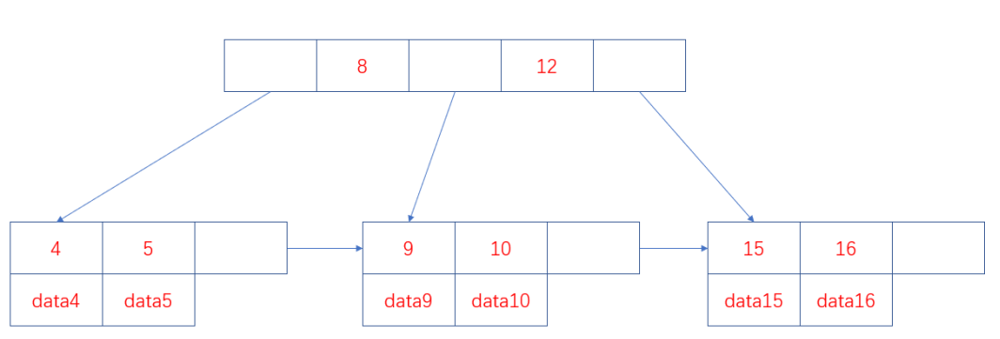

从上图可以看出 ，因为B+树具有有序性，并且所有的数据都存放在叶子节点，所以查找的效率非常高，并且支持排序和范围查找。

B+树的索引又可以分为主索引和辅助索引。其中主索引为聚簇索引，辅助索引为非聚簇索引。聚簇索引是以主键作为B+ 树索引的键值所构成的B+树索引，聚簇索引的叶子节点存储着完整的数据记录；非聚簇索引是以非主键的列作为B+树索引的键值所构成的B+树索引，非聚簇索引的叶子节点存储着主键值。所以使用非聚簇索引进行查询时，会先找到主键值，然后到根据聚簇索引找到主键对应的数据域。上图中叶子节点存储的是数据记录，为聚簇索引的结构图，非聚簇索引的结构图如下： 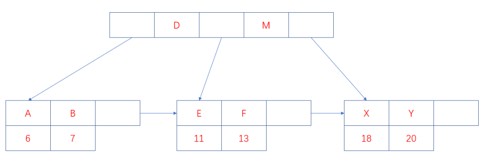`

上图中的字母为数据的非主键的列值，假设要查询该列值为B的信息，则需先找到主键7，在到聚簇索引中查询主键7所对应的数据域。

- 哈希索引
  哈希索引是基于哈希表实现的，对于每一行数据，存储引擎会对索引列通过哈希算法进行哈希计算得到哈希码，并且哈希算法要尽量保证不同的列值计算出的哈希码值是不同的，将哈希码的值作为哈希表的key值，将指向数据行的指针作为哈希表的value值。这样查找一个数据的时间复杂度就是 o(1)，一般多用于精确查找

### Hash索引和B+树的区别？

因为两者数据结构上的差异导致它们的使用场景也不同，哈希索引一般多用于**精确的等值查找**，B+索引则多用于除了精确的等值查找外的其他查找。在**大多数**情况下，会选择使用B+树索引。

- 哈希索引**不支持排序**，因为哈希表是无序的。
- 哈希索引**不支持范围查找**。
- 哈希索引**不支持模糊查询及多列索引的最左前缀匹配**。
- 因为哈希表中会存在哈希冲突，所以哈希索引的**性能是不稳定**的，而B+树索引的性能是相对稳定的，每次查询都是从根节点到叶子节点

### 索引的类型有哪些?

MySQL主要的索引类型主要有FULLTEXT，HASH，BTREE，RTREE。

- FULLTEXT
  FULLTEXT即全文索引，MyISAM存储引擎和InnoDB存储引擎在MySQL5.6.4以上版本支持全文索引，一般用于查找文本中的关键字，而不是直接比较是否相等，多在CHAR，VARCHAR，TAXT等数据类型上创建全文索引。全文索引主要是用来解决 `WHERE name LIKE "%zhang%`等针对文本的模糊查询效率低的问题。
- HASH
  HASH即哈希索引，哈希索引多用于等值查询，时间复杂度为o(1)，效率非常高，但不支持排序、范围查询及模糊查询等。
- BTREE
  BTREE即B+树索引，INnoDB存储引擎默认的索引，支持排序、分组、范围查询、模糊查询等，并且性能稳定。
- RTREE
  RTREE即空间数据索引，多用于地理数据的存储，相比于其他索引，空间数据索引的优势在于范围查找

### 索引的种类有哪些？

- 主键索引：数据列不允许重复，不能为NULL，一个表只能有一个主键索引
- 组合索引：由多个列值组成的索引。
- 唯一索引：数据列不允许重复，可以为NULL，索引列的值必须唯一的，如果是组合索引，则列值的组合必须唯一。
- 全文索引：对文本的内容进行搜索。
- 普通索引：基本的索引类型，可以为NULL

### B树和B+树的区别？

B树和B+树最主要的区别主要有两点：

- B树中的内部节点和叶子节点均存放键和值，而B+**树的内部节点只有键没有值**，叶子节点存放所有的键和值。
- B＋树的叶子节点是通过相连在一起的，方便顺序检索。

两者的结构图如下。

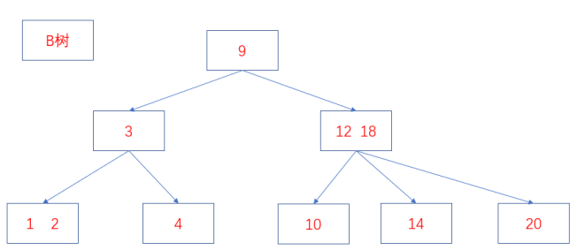

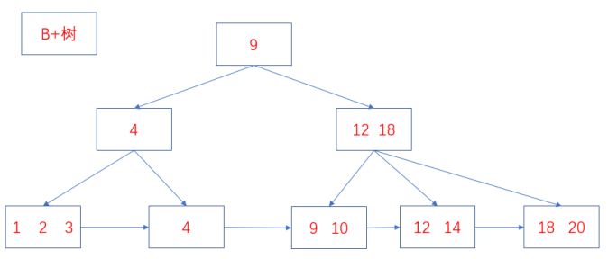

### 数据库为什么使用B+树而不是B树？

- B树适用于随机检索，而B+树适用于随机检索和顺序检索
- B+树的空间利用率更高，因为B树每个节点要存储键和值，而B+树的内部节点只存储键，这样B+树的一个节点就可以存储更多的索引，从而使树的高度变低，减少了I/O次数，使得数据检索速度更快。
- B+树的叶子节点都是连接在一起的，所以范围查找，顺序查找更加方便
- B+树的性能更加稳定，因为在B+树中，每次查询都是从根节点到叶子节点，而在B树中，要查询的值可能不在叶子节点，在内部节点就已经找到。

那在什么情况适合使用B树呢，因为B树的内部节点也可以存储值，所以可以把一些频繁访问的值放在距离根节点比较近的地方，这样就可以提高查询效率。综上所述，B+树的性能更加适合作为数据库的索引

### 什么是聚簇索引，什么是非聚簇索引？

聚簇索引和非聚簇索引最主要的区别是数据和索引是否分开存储。

- 聚簇索引：将数据和索引放到一起存储，索引结构的叶子节点保留了数据行。
- 非聚簇索引：将数据和索引分开存储，索引叶子节点存储的是指向数据行的地址。

在InnoDB存储引擎中，默认的索引为B+树索引，利用主键创建的索引为主索引，也是聚簇索引，在主索引之上创建的索引为辅助索引，也是非聚簇索引。为什么说辅助索引是在主索引之上创建的呢，因为辅助索引中的叶子节点存储的是主键。
在MyISAM存储引擎中，默认的索引也是B+树索引，但主索引和辅助索引都是非聚簇索引，也就是说索引结构的叶子节点存储的都是一个指向数据行的地址。并且使用辅助索引检索无需访问主键的索引。

可以从非常经典的两张图看看它们的区别(图片来源于网络)：

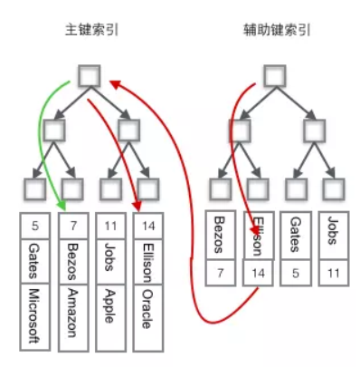

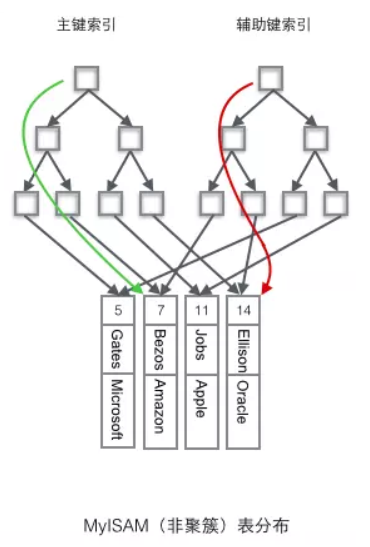

#### 各自优缺点？

##### 聚簇索引相比于非聚簇索引的优势和劣势

##### 缓存知识介绍

我们知道一次io读写，可以获取到4k（或者16K，需要看操作系统中的配置）大小的资源，我们称之为读取到的数据区域为Page（页）。当需要查询某个索引的B+树结构的时候，某些页被加载到内存的缓存区域中，查询操作会在内存里操作，而不用再次进行IO操作了。当要查询的行数据不在缓存里，才会触发新的IO操作。

##### 聚簇索引优势

通过上面的缓存知识来看，如果数据存放的位置是相对连续的，则缓存命中率会很高。而聚簇索引正好就是在磁盘上连续存放的。因为MyISAM的主索引并非聚簇索引，那么他的数据的物理地址（硬盘数据区的编号）相对于聚簇索引是比较凌乱的，拿到这些物理地址，按照合适的算法进行I/O读取，于是开始不停的寻道不停的旋转，且存储地址跨度过大，也容易导致缓存命中率低。

另外，如果数据发生改变，其存储地址很可能也会发生改变。这时候myisam由于索引存放的是存储地址，所以需要更新索引结构。聚簇索引除了主键索引以外的索引，存储的都是主键，主键不发生改变二级索引基本不需要维护，只需要维护主键索引就好了。

##### 聚簇索引劣势

但是聚簇索引并不是没有缺点，最显著的缺点就是二级索引查询的时候，都需要查询两次，第一次查询二级索引树，拿到主键，第二次再回表拿到真实的行数据。另外如果说主键选择不当的时候，会容易经常的触发聚簇索引的树结构旋转，重排甚至是页分裂等，所以我们是建议使用自增列来做主键的。

### 非聚簇索引一定会进行回表查询吗？

上面是说了非聚簇索引的叶子节点存储的是主键，也就是说要先通过非聚簇索引找到主键，再通过聚簇索引找到主键所对应的数据，后面这个再通过聚簇索引找到主键对应的数据的过程就是回表查询，那么非聚簇索引就一定会进行回表查询吗？答案是不一定的，这里涉及到一个**索引覆盖**的问题，如果查询的数据再辅助索引上完全能获取到便不需要回表查询。例如有一张表存储着个人信息包括id、name、age等字段。假设聚簇索引是以~~ID~~为键值构建的索引，非聚簇索引是以~~name~~为键值构建的索引， `select id,name from user where name = 'zhangsan'`; 这个查询便不需要进行回表查询因为，通过非聚簇索引已经能全部检索出数据，这就是索引覆盖的情况。如果查询语句是这样， `select id,name,age from user where name = 'zhangsan'`; 则需要进行回表查询，因为通过非聚簇索引不能检索出~~age~~的值。那应该如何解决那呢？只需要将索引覆盖即可，建立age和name的联合索引再使用 `select id,name,age from user where name = 'zhangsan';` 进行查询即可。

所以通过索引覆盖能解决非聚簇索引回表查询的问题。

### 索引的使用场景有哪些？

- 对于中大型表建立索引非常有效，对于非常小的表，一般全部表扫描速度更快些。
- 对于超大型的表，建立和维护索引的代价也会变高，这时可以考虑分区技术。
- 如果表的增删改非常多，而**查询需求非常少**的话，那就没有必要建立索引了，因为维护索引也是需要代价的。
- 一般不会出现在 ~~where~~ 条件中的字段就没有必要建立索引了。
- 多个字段经常被查询的话可以考虑联合索引。
- 字段多且字段值没有重复的时候考虑唯一索引。
- 字段多且有重复的时候考虑普通索引。

### 索引的设计原则？

- 最适合索引的列是在where后面出现的列或者连接句子中指定的列，而不是出现在SELECT关键字后面的选择列表中的列。
- 索引列的基数越大，索引的效果越好，换句话说就是**索引列的区分度越高，索引的效果越好**。比如使用性别这种区分度很低的列作为索引，效果就会很差，因为列的基数最多也就是三种，大多不是男性就是女性。
- 尽量使用短索引，对于较长的字符串进行索引时应该指定一个较短的前缀长度，因为较小的索引涉及到的磁盘I/O较少，并且索引高速缓存中的块可以容纳更多的键值，会使得查询速度更快。
- 尽量利用最左前缀。
- 不要过度索引，每个索引都需要额外的物理空间，维护也需要花费时间，所以索引不是越多越好。
- 定义有外键的数据列一定要建立索引。
- 尽量的扩展索引，不要新建索引。比如表中已经有a的索引，现在要加(a,b)的索引，那么只需要修改原来的索引即可。
- 对于定义为text、image和bit的数据类型的列不要建立索引。

### 如何对索引进行优化？

对索引的优化其实最关键的就是要符合索引的设计原则和应用场景，将不符合要求的索引优化成符合索引设计原则和应用场景的索引。
除了索引的设计原则和应用场景那几点外，还可以从以下两方面考虑。

- 在进行查询时，索引列不能是表达式的一部分，也不能是函数的参数，因为这样无法使用索引。例如			 `select * from table_name where a + 1 = 2`
- 将区分度最高的索引放在前面
- 尽量少使用 `select *`

索引的使用场景、索引的设计原则和如何对索引进行优化可以看成一个问题。

### 如何创建/删除索引？

> 创建索引

- 使用CREATE INDEX 语句
  CREATE INDEX index_name ON table_name (column_list);

- 在CREATE TABLE时创建

  ```mysql
  CREATE TABLE user(
      id INT PRIMARY KEY,
      information text,
      FULLTEXT KEY (information)
  );
  ```

- 使用ALTER TABLE创建索引

  ```mysql
  ALTER TABLE table_name ADD INDEX index_name (column_list);
  ```

> 删除索引

- 删除主键索引
  ~~alter table 表名 drop primary key~~
- 删除其他索引
  ~~alter table 表名 drop key~~

### 使用索引查询时性能一定会提升吗？

不一定，前面在索引的使用场景和索引的设计原则中已经提到了如何合理地使用索引，因为创建和维护索引需要花费空间和时间上的代价，如果不合理地使用索引反而会使查询性能下降。

### 什么是前缀索引？

前缀索引是指对文本或者字符串的前几个字符建立索引，这样索引的长度更短，查询速度更快。

使用场景：前缀的区分度比较高的情况下。

建立前缀索引的方式
`ALTER TABLE table_name ADD KEY(column_name(prefix_length));`

这里面有个prefix_length参数很难确定，这个参数就是前缀长度的意思。通常可以使用以下方法进行确定，先计算全列的区分度

`SELECT COUNT(DISTINCT column_name) / COUNT(*) FROM table_name;`

然后在计算前缀长度为多少时和全列的区分度最相似。
`SELECT COUNT(DISTINCT LEFT(column_name, prefix_length)) / COUNT(*) FROM table_name;`
不断地调整prefix_length的值，直到和全列计算出区分度相近

### 什么是最左匹配原则？

最左匹配原则：从最左边为起点开始连续匹配，遇到**范围查询**（<、>）**会停止匹配**。

遇到between, <=, >=, like, 并不一定会停止匹配： https://zhuanlan.zhihu.com/p/573138586?utm_campaign=&utm_medium=social&utm_oi=897764131648729088&utm_psn=1564623504359514112&utm_source=qq

例如建立索引(a,b,c)，大家可以猜测以下几种情况是否用到了索引。

- 第一种

  ```mysql
  select * from table_name where a = 1 and b = 2 and c = 3
  select * from table_name where b = 2 and a = 1 and c = 3
  ```

  上面两次查询过程中所有值都用到了索引，where后面字段调换不会影响查询结果，因为MySQL中的优化器会自动优化查询顺序。

- 第二种

  ```mysql
  select * from table_name where a = 1
  select * from table_name where a = 1 and b = 2
  select * from table_name where a = 1 and b = 2 and c = 3
  ```

  答案是三个查询语句都用到了索引，因为三个语句都是从最左开始匹配的。

- 第三种

  ```mysql
  select * from table_name where b = 1
  select * from table_name where b = 1 and c = 2
  ```

  答案是这两个查询语句都没有用到索引，因为不是从最左边开始匹配的

- 第四种

  ```mysql
  select * from table_name where a = 1 and c = 2
  ```

  这个查询语句只有a列用到了索引，c列没有用到索引，因为中间跳过了b列，不是从最左开始连续
  匹配的。

- 第五种

  ```mysql
  select * from table_name where a = 1 and b < 3 and c < 1
  ```

  这个查询中只有a列和b列使用到了索引，而c列没有使用索引，因为根据最左匹配查询原则，遇到
  范围查询会停止。

- 第六种

  ```mysql
  select * from table_name where a like 'ab%';
  select * from table_name where a like '%ab'
  select * from table_name where a like '%ab%'
  ```

  对于列为字符串的情况，**只有前缀匹配可以使用索引**，中缀匹配和后缀匹配只能进行全表扫描。

### 索引在什么情况下会失效？

在上面介绍了几种不符合最左匹配原则的情况会导致索引失效，除此之外，以下这几种情况也会导致索引失效。

- 条件中有or，例如 `select * from table_name where a = 1 or b = 3`
- 在索引上进行计算会导致索引失效，例如 `select * from table_name where a + 1 = 2` 在索引的类型上进行数据类型的隐形转换，会导致索引失效，例如字符串一定要加引号，假设 `select * from table_name where a = '1'` 会使用到索引，如果写成 `select * from table_name where a = 1` 则会导致索引失效。
- 在索引中使用函数会导致索引失效，例如 `select * from table_name where abs(a) = 1`
- 在使用like查询时以%开头会导致索引失效
- 索引上使用！、=、<>进行判断时会导致索引失效，例如 `select * from table_name where a != 1`
- 索引字段上使用 ~~is null/is not null~~判断时会导致索引失效，例如 `select * from table_name where a is null`

## 数据库的事务　＊＊＊

### 什么是数据库的事务？

百度百科的解释：数据库事务( transaction)是访问并可能操作各种数据项的一个数据库操作序列，这些操作要么全部执行,要么全部不执行，是一个不可分割的工作单位。事务由事务开始与事务结束之间执行的全部数据库操作组成。

### 事务的四大特性是什么？

- 原子性：原子性是指包含事务的操作要么全部执行成功，要么全部失败回滚。
- 一致性：一致性指事务在执行前后状态是一致的。
- 隔离性：一个事务所进行的修改在最终提交之前，对其他事务是不可见的。
- 持久性：数据一旦提交，其所作的修改将永久地保存到数据库中。

通常，**事务的隔离性通过并发控制实现；而原子性、一致性、持久性则通过预写日志实现**。

### 数据库的并发一致性问题

当多个事务并发执行时，可能会出现以下问题：

- 脏读：事务A更新了数据，但还没有提交，这时事务B读取到事务A更新后的数据，然后事务A回滚了，事务B读取到的数据就成为脏数据了。
- 不可重复读：事务A对数据进行多次读取，事务B在事务A多次读取的过程中执行了更新操作并提交了，导致事务A多次读取到的数据并不一致。
- 幻读：事务A在读取数据后，事务B向事务A读取的数据中插入了几条数据，事务A再次读取数据时发现多了几条数据，和之前读取的数据不一致。
- 丢失修改：事务A和事务B都对同一个数据进行修改，事务A先修改，事务B随后修改，事务B的修改覆盖了事务A的修改。

不可重复读和幻读看起来比较像，它们主要的区别是：在不可重复读中，发现数据不一致主要是**数据被更新**了。在幻读中，发现数据不一致主要是**数据增多或者减少**了。

### 数据库的隔离级别有哪些？

- 未提交读：一个事务在提交前，它的修改对其他事务也是可见的。
- 提交读：一个事务提交之后，它的修改才能被其他事务看到。
- 可重复读：在同一个事务中多次读取到的数据是一致的。
- 串行化：需要加锁实现，会强制事务串行执行。

数据库的隔离级别分别可以解决数据库的脏读、不可重复读、幻读等问题

| 隔离级别                  | 脏读   | 不可重复读 | 幻读   |
| ------------------------- | ------ | ---------- | ------ |
| 未提交读(Read Uncommited) | 允许   | 允许       | 允许   |
| 提交读(Read Ccommited)    | 不允许 | 允许       | 允许   |
| 可重复读(Repeatable Read) | 不允许 | 不允许     | 允许   |
| 串行化                    | 不允许 | 不允许     | 不允许 |

**MySQL的默认隔离级别是可重复读。**

> 幻读举例

银行 A 开启了一个事务窗口，查询当前系统中有没有 “zjz” 用户，发现没有，银行 B 也开启了一个事务窗口，查询当前系统中也没有  “zjz” 用户，银行 A 先创建 “zjz” 用户并且提交，由于可重复读取，银行 B 在一次事务中必须保证查询的数据一致性，因此查询不到  “zjz”，结果银行 B 窗口认为 “zjz” 没有被注册想注册 “zjz” 用户，就创建 “zjz” 用户结果发现系统提示  “zjz” 用户已经被注册"，但是在本次事务中又查询不到 “zjz”，就好像出现幻觉一样。

### 隔离级别是如何实现的？

事务的隔离机制主要是依靠锁机制和MVCC(多版本并发控制)实现的，提交读和可重复读可以通过MVCC实现，串行化可以通过锁机制实现。

### 什么是MVCC？

MVCC(multiple version concurrent control)是一种控制并发的方法，主要用来提高数据库的并发性能。

在了解MVCC时应该先了解当前读和快照读。

- 当前读：读取的是数据库的最新版本，并且在读取时要保证其他事务不会修该当前记录，所以会对读取的记录加锁。
- 快照读：不加锁读取操作即为快照读，使用MVCC来读取快照中的数据，避免加锁带来的性能损耗。

可以看到MVCC的作用就是在不加锁的情况下，解决数据库读写冲突问题，并且解决脏读、幻读、不可重复读等问题，但是不能解决丢失修改问题。

> MVCC的实现原理

- 版本号
  系统版本号：是一个自增的ID，每开启一个事务，系统版本号都会递增。
  事务版本号：事务版本号就是事务开始时的系统版本号，可以通过事务版本号的大小判断事务的时间顺序。
- 行记录隐藏的列
  ~~DB_ROW_ID~~：所需空间6byte，隐含的自增ID，用来生成聚簇索引，如果数据表没有指定聚簇索引，InnoDB会利用这个隐藏ID创建聚簇索引。
  ~~DB_TRX_ID~~：所需空间6byte，最近修改的事务ID，记录创建这条记录或最后一次修改这条记录的事务ID。
  ~~DB_ROLL_PTR~~：所需空间7byte，回滚指针，指向这条记录的上一个版本。

它们大致长这样，省略了具体字段的值。·


- undo日志
  MVCC做使用到的快照会存储在Undo日志中，该日志通过回滚指针将一个一个数据行的所有快照连接起来。它们大致长这样。

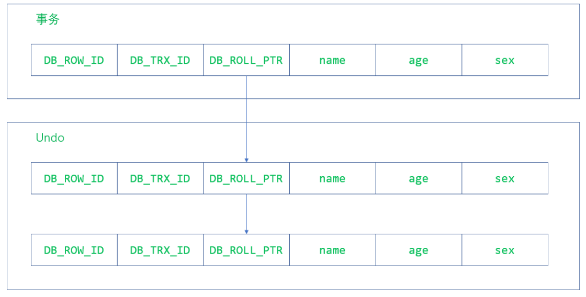

举一个简单的例子说明下，比如最开始的某条记录长这样

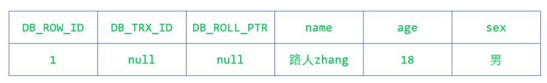

现在来了一个事务对他的年龄字段进行了修改，变成了这样

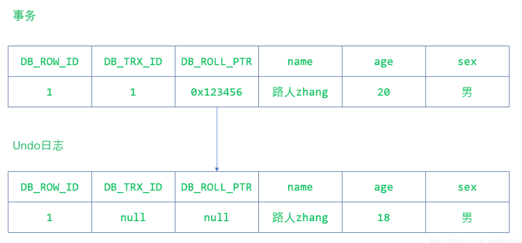

现在又来了一个事务2对它的性别进行了修改，它又变成了这样  

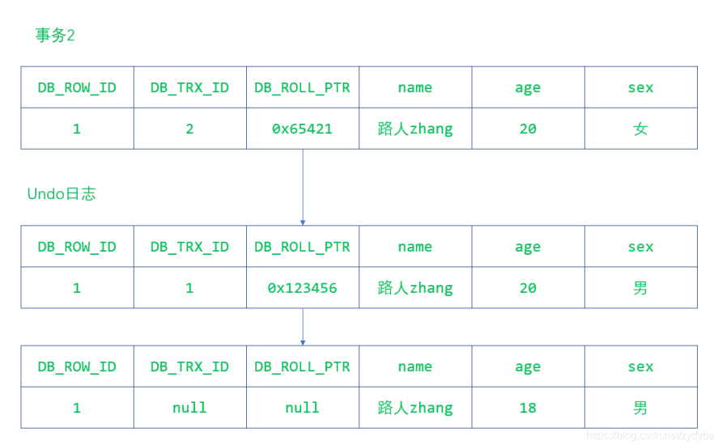

从上面的分析可以看出，事务对同一记录的修改，记录的各个会在Undo日志中连接成一个线性表，在表头的就是最新的旧纪录。

在重复读的隔离级别下，InnoDB的工作流程：

- SELECT
  作为查询的结果要满足两个条件：
  1. 当前事务所要查询的数据行快照的创建版本号必须小于当前事务的版本号，这样做的目的是保证当前事务读取的数据行的快照要么是在当前事务开始前就已经存在的，要么就是当前事务自身插入或者修改过的。
  2. 当前事务所要读取的数据行快照的删除版本号必须是大于当前事务的版本号，如果是小于等于的话，表示该数据行快照已经被删除，不能读取。
- INSERT
  将当前系统版本号作为数据行快照的创建版本号。
- DELETE
  将当前系统版本号作为数据行快照的删除版本号。
- UPDATE
  保存当前系统版本号为更新前的数据行快照创建行版本号，并保存当前系统版本号为更新后的数据行快照的删除版本号，其实就是，先删除在插入即为更新。

总结一下，MVCC的作用就是在避免加锁的情况下最大限度解决读写并发冲突的问题，它可以实现提交读和可重复读两个隔离级。

### binlog 和 redolog

#### binlog

二进制日志（binary log ），记录对 Mysql 数据库执行的所有 **更改操作**，包括 **表结构的变更** 和 **表数据的修改** 等，像 select 这种查询是不会记录 binlog 日志的。

binlog 日志采用 **追加写** 的方式写文件，一个文件写满后新写一个文件，仅在 **事务提交前** 进行一次写入。

生成的 binlog 日志文件可以用于 **备份恢复**、**主从复制** 以及 **数据审计** 等用途。

##### binlog 参数配置

binlog 日志默认是没有启动的，可以通过配置参数 **log-bin** 或 **log_bin** 来开启，开启 binlog 日志后，还有许多相关的参数可以做配置，这里捡几个重要的看下：

- max_binlog_size
- binlog_cache_size
- sync_binlog
- binlog_format

**max_binlog_size**: 指定单个日志文件的最大值，达到阈值后，会生成一个新的日志文件，后缀名 +1，并记录到 **.index** 文件，形如 mysql-bin.000001、mysql-bin.000002 ....

**binlog_cache_size**: 日志缓存区大小。在事务未提交前，所有的 binlog 日志都会记录到内存缓存，等到事务提交的时候再写入日志文件，该参数即是设置该缓存区的大小。此外，**日志缓存是基于会话的**，也就是说 **每个线程都有一块 binlog_cache_size 大小的内存缓存**，因此，该值不宜设置太大；另一方面，如果某事务占用缓存超过设置值，就需要将日志写入临时文件，因此，该值也不能设置太小。那多大比较合适？可以通过 **SHOW GLOBAL STATUS** 查看 binlog_cache_disk_use （使用临时文件写日志次数）来判定，如果该值很大，说明缓存区过小，需要经常写临时文件，此时需要适当调大该参数。

**sync_binlog**: 同步磁盘策略。我们平时写文件调用的 write() 函数其实并没有真正的将内容写到磁盘，而是写到文件系统的 page cache 里，真正将内容同步到磁盘的是 fsync() 函数。**sync_binlog 就是用来设置 fsync() 函数的执行时机的：**

- sync_binlog = 0 : 不调用 fsync() 函数，由操作系统决定何时调用；
- sync_binlog = 1 : 每个事务调用 write() 后立马执行 fsync() 函数；
- sync_binlog = N (N>1) : 累计 N 个事务调用 write() 后，执行 fsync() 函数；

**binlog_format:** 日志格式，有三种格式选择：

- STATEMENT: 基于 SQL 语句记录（可以理解为记录的就是更新数据的 sql 语句）。这种格式的日志存在一个问题，**动态函数在重放时可能产生不一致的结果**，比如记录日志时调用一个动态函数生成 uuid，那使用该 binlog 日志重放时可能会得到一个不同的 uuid 值。
- ROW: 记录数据行更改后的值，这样就避免了日志重放时因为动态函数带来的不一致的问题，但是这种格式的日志文件 **相较 STATEMENT 要大很多**，因为它记录的是每一行数据的变化值，比如执行一个 update 语句更新了 1w 条数据，采用 STATEMENT 格式就是记录这个 update 语句即可，而 ROW 则要记录这 1w 条数据更新后的值。
- MIXED: 包含以上两个格式，默认采用 STATEMENT 记录，而对于使用 STATEMENT 记录可能产生问题的 SQL 语句则使用 ROW 记录。

无论采用哪种格式，它记录的都是 **关于一个事务的具体操作内容**，因此 binlog 日志也被称为 **逻辑日志**。

##### 场景举例

主从复制是 mysql 提供的一种 **高可用高性能** 的解决方案。具体来说，在主从复制架构下，如果主库发生意外，可以切换到从库继续提供服务（高可用）；此外，主从库可以实现读写分离，主库可接收读写请求，从库只提供读请求能力，可以大大提高数据库整体的查询能力（高性能）。

主从复制原理很简单，包含以下三个步骤：

1、主库记录二进制日志文件；

2、从库将主库的日志文件复制到自身的中继日志(relay log)；

3、从库对中继日志进行重放。

复制具体过程涉及三个线程操作：

1、**主库的 log dump 线程** 负责将二进制文件发送到从库；

2、**从库的 I/O 线程** 负责读取二进制文件并保存到从库的 relay log 中；

3、**从库的 SQL 线程** 负责读取 relay log 在本地进行重放。

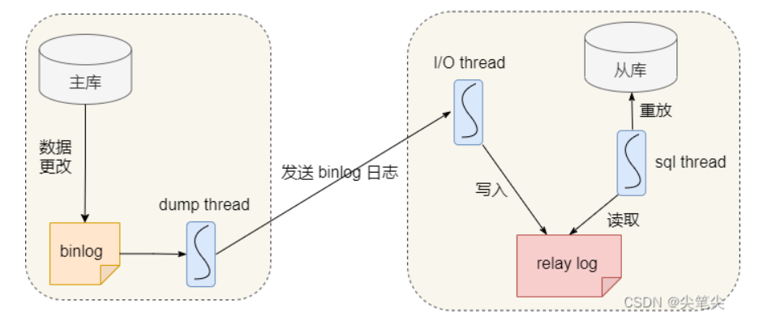

#### redo log 日志

------

Innodb 基于磁盘存储，同时按 **页** 的方式来管理记录，一个页的大小默认为 16KB。如果每次查询或修改都要按页和磁盘进行 IO 交互会严重影响数据库的性能，因此引入了 **内存缓存**；

有了内存缓存，在对数据进行查询时，先查缓存，如果数据存在直接返回，如果不存在则去磁盘读取并将读取到的页放到缓存池中，然后再返回数据；对数据的修改也是 **先修改缓存池的页，而后异步的将页刷新回磁盘**。但是异步刷新磁盘也带来一个新问题：在刷新磁盘前如果意外宕机，重启后内存数据已经没有了，就会导致数据丢失。

为了避免数据丢失，Innodb 采用了 **Write Ahead Log(WAL)** 策略，即 **当事务提交时，先写日志，再修改页**，当发生意外宕机时，可以通过日志来恢复数据，这个日志就叫做 **redo log**，它保证了事务的 **持久性**。

区别于 binlog 日志，redo log 是 **Innodb 引擎独有的日志模块**，它只记录有关 Innodb 引擎的事务日志，记录内容为 **对数据页的物理操作**（比如 偏移量 500，写 ‘jianbijian’）。

##### redo log 参数配置

- innodb_log_file_size
- innodb_log_files_in_group
- innodb_mirrored_log_groups
- innodb_flush_log_at_trx_commit

每个 Innodb 引擎都 **至少有 1 个 重做日志文件组**，而 **每个重做日志组下又至少有 2 个重做日志文件**；参数 **innodb_mirrored_log_groups** 和 **innodb_log_files_in_group** 分别用来设定 重做文件组的个数 和 每个组内文件的个数，日志组中每个日志文件大小一致，并以循环写入的方式运行。

**innodb_log_file_size**: 设定每个重做日志文件的大小，这个参数很重要。首先它不能设置的太小，因为重做日志文件是 **循环写入** 的，如果设置的太小会导致频繁的 **async/sync checkpoint**，当然也不能设置的超大，这样做数据恢复的时候耗时就很长。

**async/sync checkpoint**： 重做日志不可用时，需要强制将一些页刷新回磁盘。

> 重做日志写入流程

> 重做日志是对日志组内的几个日志文件 **循环写入** 的（比如有两个重做日志文件 logfile1 和 logfile2，先写 logfile1, logfile1 写满后开始写 logfile2, logfile2  写满后又重新开始写 logfile1），将日志组内的 N 个文件组合起来想象成一个圆，此时总的文件大小  total_redo_log_file_size = N * innodb_log_file_size ，有两个指针，一个表示 redo log 新增时的写入指针 redo_lsn，一个表示异步刷新回磁盘最新页后的记录指针 checkpoint_lsn，再定义一个变量  checkpoint_age = redo_lsn - checkpoint_lsn， 正常情况下都有 0 <=  checkpoint_age <  total_redo_log_file_size，而如果事务比较频繁，innodb_log_file_size 又比较小的，就可能出现  checkpoint_age 的大小达到 total_redo_log_file_size，即 redo_lsn 绕了一圈追上了  checkpoint_lsn，这时不能让 redo_lsn 直接覆写 checkpoint_lsn 位置的值，因为 checkpoint_lsn 位置的记录还没同步到磁盘，即 **重做日志不可用**。
>
> innodb 其实不会等到 redo_lsn 追上 checkpoint_lsn，而是定义了两个水位线 **async_water_mark** 和 **sync_water_mark**：
>
> async_water_mark = 0.75 * total_redo_log_file_size
>
> sync_water_mark= 0.9 * total_redo_log_file_size
>
> 遵循以下规则刷新脏页：
>
> 1、checkpoint_age < async_water_mark 时，不需要刷新页回磁盘，直接追加 redo log 日志即可；
>
> 2、async_water_mark < checkpoint_age < sync_water_mark 时触发 Async Flush 将脏页刷新回磁盘，直到满足 checkpoint_age < async_water_mark；
>
> 3、sync_water_mark < checkpoint_age 时触发 Sync Flush 将脏页刷新回磁盘，直到满足 checkpoint_age < async_water_mark
>
> 需要注意的是，在 Innodb 1.2.x 之前，Async Flush 会阻塞发现问题的用户线程，  Sync Flush 则会阻塞所有线程；但在 Mysql 5.6 之后，刷新脏页由单独的 Page cleaner thread  完成，都不再阻塞用户线程。

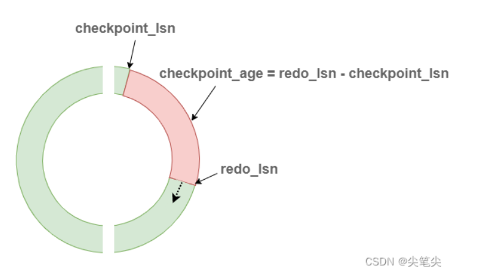

**innodb_flush_log_at_trx_commit**： 提交事务时的重做日志同步磁盘策略。

redo log 也有对应的缓存 **redo log buffer**，写日志时先写 redo log buffer，然后再按一定条件 **顺序地** 写入日志文件；再考虑到文件系统的缓存，一条 redo log 日志从生成到同步磁盘的路径为:

redo log buffer --> page cache --> redo log file；

**innodb_flush_log_at_trx_commit** 有 0,1,2 三个有效值：

- 0：提交事务时，不同步重做日志到磁盘，即日志仅记录在 redo log buffer 中；
- 1：提交事务时，将缓存同步到磁盘；
- 2：提交事务时，将缓存写到 page cache，但不会同步到磁盘，即没有 fsync() 的调用。

可以看到，**如果想要确保事务的持久性，必须将该参数设置为 1；**

设置为 0 的时候，redo log buffer 中的内容要等到后台主线程每秒的任务才会刷新到磁盘，如果中途 mysql 实例宕机，可能丢失 1 秒的日志；

设置为 2 的时候也是等待主线程每秒的任务刷新磁盘，但是在事务提交时，已经将日志缓存写到了操作系统的 page cache，所以只要操作系统不重启，内容也不会丢失。

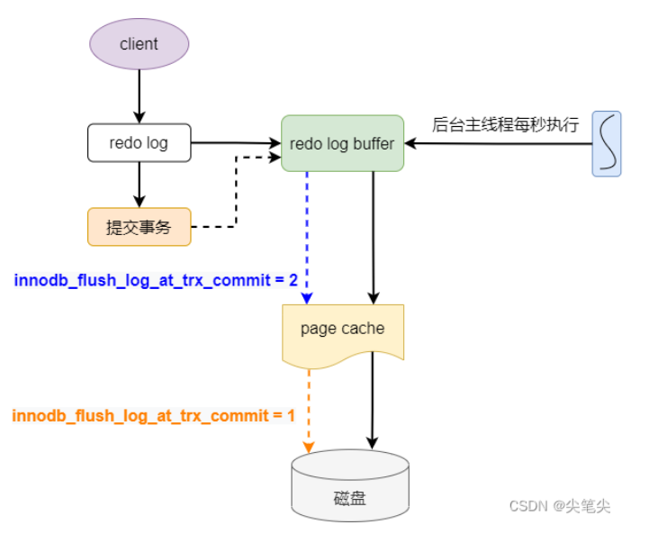

#### 为什么需要 redo log

我们已经知道 redo log 的目的是防止数据丢失，保证事务的持久性。但是下面两个问题还是值得思考的：

> 1、在事务提交时，要先同步重做日志到磁盘再修改数据页，为什么不直接将数据页同步到磁盘？

如果去掉 redo  log，在页数据发生变更后直接将页同步到磁盘当然也可以保证事务的持久性，但是效率极低。默认情况下，一个页的大小为16KB，可以记录多条记录，而一个变更可能就涉及到一条或几条记录，它就要将记录所在的整个页同步到磁盘，属实浪费；其次，将页同步到磁盘涉及对 I/O 的 **随机写** 操作，效率低下。重做日志是对日志文件的追加操作，属于 **顺序写**，顺序写毫无疑问要比随机写快；此外，即使事务还没有提交，mysql 后台主线程每秒都会将重做日志同步到磁盘，因此，即使是很大的事务提交时间也很短。

> 2、binlog 日志也是事务提交前的日志，为啥不直接用 binlog 日志做恢复？

这个问题网上有诸多答案，归纳几点：

1. 从日志格式来看，STATEMENT 格式的日志因为动态函数的原因，肯定不能用作数据恢复；
2. 从恢复效率来看，首先，binlog 日志是逻辑日志，而 redo log 日志是物理日志，恢复更快；其次，binlog 日志是追加写文件，而 redo log  日志是循环写的，在脏页刷新回磁盘后即可被覆盖，因此在做数据恢复时，redo log 记录的内容本身就会比 binlog 更少。

------

### binlog 和 redo log 区别

|                  | binlog                         | redo log                       |
| ---------------- | ------------------------------ | ------------------------------ |
| 适用对象不同     | mysql server 层                | Innodb 存储引擎层              |
| 写入方式不同     | 追加写，一个文件满了写新文件   | 循环写固定文件                 |
| 文件格式不同     | 逻辑日志，一个事务具体操作内容 | 物理日志，页的修改情况         |
| 写入磁盘时间不同 | 提交事务前一次写入             | 在事务进行中有后台线程不断同步 |
| 用途不同         | 主从复制、数据备份             | 数据恢复                       |

### 两阶段提交

在主从复制模式下，会开启 binlog  日志。此时，主库提交事务时，既要写二进制日志，还要写重做日志，mysql  需要保证两个操作的原子性。假如它们不满足原子性，比如先写完二进制日志后，如果 mysql 实例发生宕机，重启后，由于 redo log  日志没有记录的原因，在做数据恢复后主库将丢失这个数据更新，而从库却根据 binlog 日志进行了重放，最终导致主从不一致。

mysql 结合 **内部 XA 事务** 和 **两阶段提交方案** 来实现这两个操作的原子性，看看具体流程：

1、**prepare 阶段**：事务提交时，先写 redo log，**同时记录 XA 事务的 ID (XID)**，标记为 prepare 状态；

2、写入 binlog 日志，**同时记录 XID**；

3、**commit 阶段**：再次写 redo log，标记为 commit 状态。

我们看看它是如果通过以上步骤实现原子性的：

在 mysql 使用 redo log 做数据恢复时，如果发现 redo log 处于 commit 状态，则表示 binlog 一定落盘了，可以直接恢复；

如果发现 redo log 处于 prepare 状态，就要根据 XID 和 binlog 日志来判断：

- 如果在 binlog 找不到这个 XID，说明还没有同步 binlog，回滚事务；
- 反之说明两个日志都已同步成功，提交事务。


### 如何解决幻读？

#### 快照读

MySQL在**可重复读**隔离级别下，是通过MVCC机制避免幻读的。

MVCC机制，可以简单理解成在事务启动的时候对数据库拍了个“**快照**”，它保留了那个时刻数据库的数据状态，那么这个事务后续的读取都可以从这个“**快照**”中获取，哪怕其他事务新加了数据，也不会影响到“**快照**”中的数据，也就不会出现幻读了。

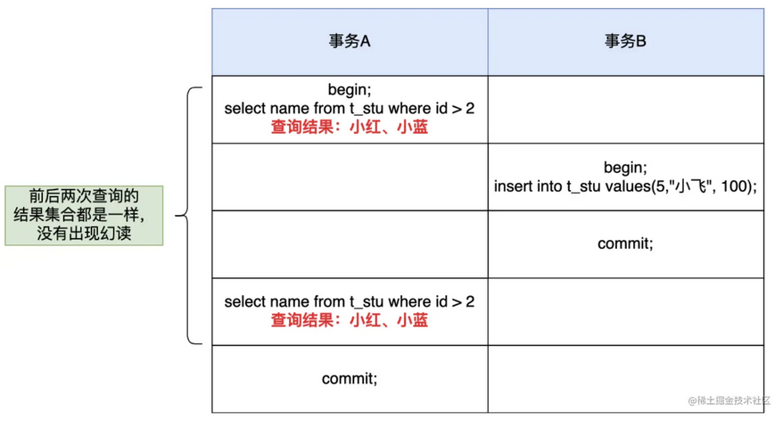

- 事务A在启动的时候创建了一个“**快照**”，查询出结果“小红，小蓝”
- 后续事务B插入一条记录“小飞”，提交
- 然后事务A再次同样查询条件查询，它会使用“**快照**”读取，所以还是“小红，小蓝”

**小结：** 针对快照读（普通 select 语句），是通过 MVCC 方式解决了幻读。

#### 当前读是如何避免幻读的？

普通读（快照读）实际上读取的是**历史版本**中的数据，但一直用这种方式读取在某些场景下是有问题的。

假设你要 `update` 一个记录，但是另一个事务已经 `delete` 这条记录并且提交事务了，这样不是会产生冲突吗，所以 `update` 的时候肯定要知道最新的数据。也就是要做**当前读**。

**那么针对当前读，MySQL在可重复读隔离级别下是如何避免幻读的呢？**

也就是说不能读取“**快照**”了，因为你要最新状态的数据，那么能不能在当前读的时候，对这段区间都加上锁，让别的事务阻塞，无法插入。因此，MySQL `InnoDB`引擎为了解决可重复读隔离级别使用当前读而造成的幻读问题，引入了**间隙锁**。

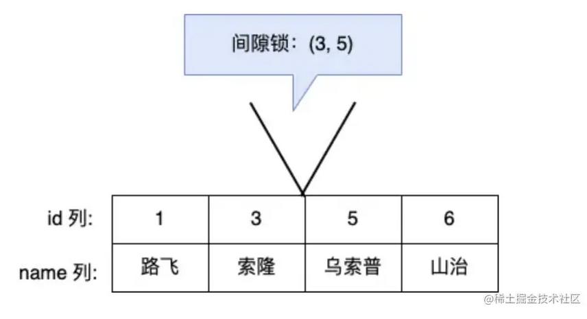

表中有一个范围 id 为（3，5）间隙锁，那么其他事务就无法插入 id = 4 这条记录了，这样就有效的防止幻读现象的发生。

**举个例子：**

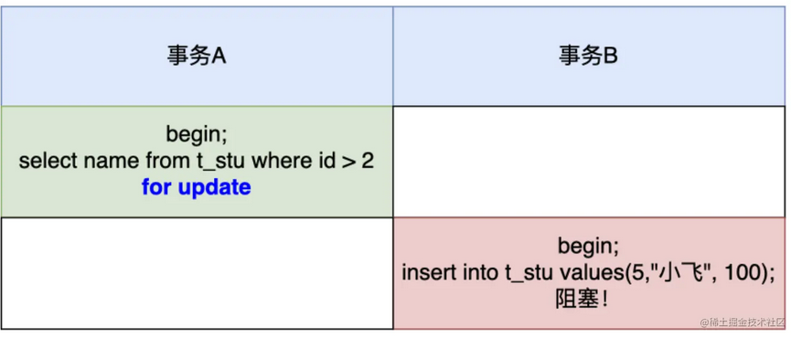

- 事务A的 `for_update`是属于当前读，它会对锁定 id 范围 ` (2, +∞]` ，相当于理解是**间隙锁。**
- 事务B插入了 `id=5`的数据，`(2, +∞]`范围被锁定了，所以无法插入，阻塞。
- 通过这种加锁阻塞的方式，也可以避免幻读。

**小结：** 针对当前读（select ... for update 等语句），是通过 `next-key lock`（记录锁+间隙锁）方式解决了幻读。

#### 总结

MySQL默认采用的隔离级别是可重复读，在这种隔离级别下不同的读模式，针对幻读问题采用了不同解决方案：

- 针对快照读（普通 `select` 语句），是通过 MVCC 方式解决了幻读。
- 针对当前读（`select ... for update` 等语句），是通过 `next-key lock`（记录锁+间隙锁）方式解决了幻读。

但是，强调一点的是，MySQL在可重复读级别下，并没有完完全全的解决幻读问题，特别是在一个事务的快照读和当前读穿插使用的场景下，还是会出现幻读的情况，比如下图所示。

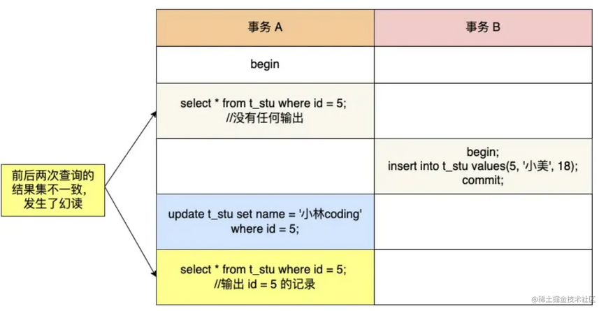


## 数据库的锁　***

### 什么是数据库的锁？

当数据库有并发事务的时候，保证数据访问顺序的机制称为锁机制。

### 数据库的锁与隔离级别的关系？

| 隔离级别 | 实现方式                                 |
| -------- | ---------------------------------------- |
| 未提交读 | 总是读取最新的数据，无需加锁             |
| 提交读   | 读取数据时加共享锁，读取数据后释放共享锁 |
| 可重复读 | 读取数据时加共享锁，事务结束后释放共享锁 |
| 串行化   | 锁定整个范围的键，一直持有锁直到事务结束 |

### 数据库锁的类型有哪些？

按照锁的粒度可以将MySQL锁分为三种：

| MySQL锁类别 | 资源开销 | 加锁速度 | 是否会出现死锁 | 锁的粒度 | 并发度 |
| ----------- | -------- | -------- | -------------- | -------- | ------ |
| 表级锁      | 小       | 快       | 不会           | 大       | 低     |
| 行级锁      | 大       | 慢       | 会             | 小       | 高     |
| 页面锁      | 一般     | 一般     | 不会           | 一般     | 一般   |

MyISAM默认采用表级锁，InnoDB默认采用行级锁。

从锁的类别上区别可以分为共享锁和排他锁

- 共享锁：共享锁又称读锁，简写为S锁，一个事务对一个数据对象加了S锁，可以对这个数据对象进行读取操作，但不能进行更新操作。并且在加锁期间其他事务只能对这个数据对象加S锁，不能加X锁。
- 排他锁：排他锁又称为写锁，简写为X锁，一个事务对一个数据对象加了X锁，可以对这个对象进行读取和更新操作，加锁期间，其他事务不能对该数据对象进行加X锁或S锁。

它们的兼容情况如下：


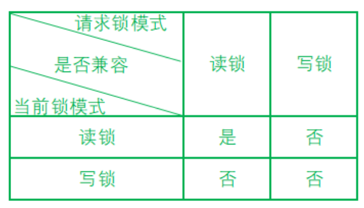

MySQL中InnoDB引擎的行锁模式及其是如何实现的？

**行锁模式**

在存在行锁和表锁的情况下，一个事务想对某个表加X锁时，需要先检查是否有其他事务对这个表加了锁或对这个表的某一行加了锁，对表的每一行都进行检测一次这是非常低效率的，为了解决这种问题，实现多粒度锁机制，InnoDB还有两种内部使用的意向锁，两种意向锁都是表锁。

- 意向共享锁：简称IS锁，一个事务打算给数据行加共享锁前必须先获得该表的IS锁。
- 意向排他锁：简称IX锁，一个事务打算给数据行加排他锁前必须先获得该表的IX锁。

有了意向锁，一个事务想对某个表加X锁，只需要检查是否有其他事务对这个表加了X/IX/S/IS锁即可。

锁的兼容性如下：


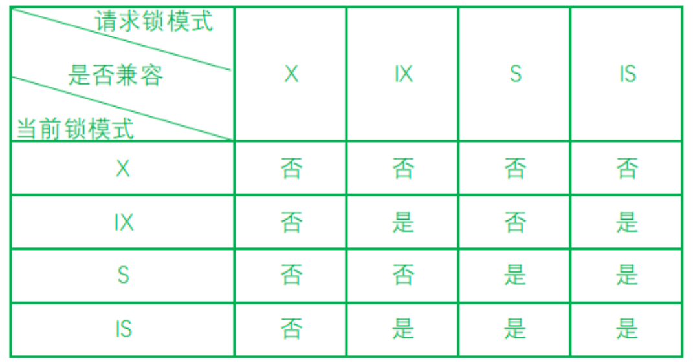

行锁实现方式：INnoDB的行锁是通过给索引上的索引项加锁实现的，如果没有索引，InnoDB将通过隐藏的聚簇索引来对记录进行加锁。

InnoDB行锁主要分三种情况：

- Record lock：对索引项加锁
- Grap lock：对索引之间的“间隙”、第一条记录前的“间隙”或最后一条后的间隙加锁。
- Next-key lock：前两种放入组合，对记录及前面的间隙加锁。

InnoDB行锁的特性：如果不通过索引条件检索数据，那么InnoDB将对表中所有记录加锁，实际产生的效果和表锁是一样的。

MVCC不能解决幻读问题，在可重复读隔离级别下，使用MVCC+Next-Key Locks可以解决幻读问题。

### 什么是数据库的乐观锁和悲观锁，如何实现？

- 乐观锁：系统假设数据的更新在大多数时候是不会产生冲突的，所以数据库只在更新操作提交的时候对数据检测冲突，如果存在冲突，则数据更新失败。

  实现方式：一般通过版本号和CAS算法实现。

- 悲观锁：假定会发生并发冲突，屏蔽一切可能违反数据完整性的操作。通俗讲就是每次去拿数据的时候都认为别人会修改，所以每次在拿数据的时候都会上锁。

  实现方式：通过数据库的锁机制实现，对查询语句添加for update。

### 什么是死锁？如何避免？

死锁是指两个或者两个以上进程在执行过程中，由于竞争资源或者由于彼此通信而造成的一种阻塞的现象。在MySQL中，MyISAM是一次获得所需的全部锁，要么全部满足，要么等待，所以不会出现死锁。
在InnoDB存储引擎中，除了单个SQL组成的事务外，锁都是逐步获得的，所以存在死锁问题。

如何避免MySQL发生死锁或锁冲突：

- 如果不同的程序并发存取多个表，尽量以相同的顺序访问表。
- 在程序以批量方式处理数据的时候，如果已经对数据排序，尽量保证每个线程按照固定的顺序来处理记录。

* 在事务中，如果需要更新记录，应直接申请足够级别的排他锁，而不应该先申请共享锁，更新时再申请排他锁，因为在当前用户申请排他锁时，其他事务可能已经获得了相同记录的共享锁，从而造成锁冲突或者死锁。
* 尽量使用较低的隔离级别
* 尽量使用索引访问数据，使加锁更加准确，从而减少锁冲突的机会
* 合理选择事务的大小，小事务发生锁冲突的概率更低
* 尽量用相等的条件访问数据，可以避免Next-Key锁对并发插入的影响。
* 不要申请超过实际需要的锁级别，查询时尽量不要显式加锁
* 对于一些特定的事务，可以表锁来提高处理速度或减少死锁的概率。

## SQL语句基础知识

### SQL语句主要分为哪几类　＊

- 数据据定义语言DDL（Data Definition Language）：主要有CREATE，DROP，ALTER等对逻辑结构有操作的，包括表结构、视图和索引。
- 数据库查询语言DQL（Data Query Language）：主要以SELECT为主
- 数据操纵语言DML（Data Manipulation Language）：主要包括INSERT，UPDATE，DELETE
- 数据控制功能DCL（Data Control Language）：主要是权限控制能操作，包括GRANT，REVOKE，COMMIT，ROLLBACK等

### SQL约束有哪些？　＊＊

- 主键约束：主键为在表中存在一列或者多列的组合，能唯一标识表中的每一行。一个表只有一个主键，并且主键约束的列不能为空。
- 外键约束：外键约束是指用于在两个表之间建立关系，需要指定引用主表的哪一列。只有主表的主键可以被从表用作外键，被约束的从表的列可以不是主键，所以创建外键约束需要先定义主表的主键，然后定义从表的外键。
- 唯一约束：确保表中的一列数据没有相同的值，一个表可以定义多个唯一约束。
- 默认约束：在插入新数据时，如果该行没有指定数据，系统将默认值赋给该行，如果没有设置没默认值，则为NULL。
- Check约束：Check会通过逻辑表达式来判断数据的有效性，用来限制输入一列或者多列的值的范围。在列更新数据时，输入的内容必须满足Check约束的条件。

### 什么是子查询？　＊＊

子查询：把一个查询的结果在另一个查询中使用

子查询可以分为以下几类：

- 标量子查询：指子查询返回的是一个值，可以使用 =,>,<,>=,<=,<>等操作符对子查询标量结果进行比较，一般子查询会放在比较式的右侧。

  ```mysql
  SELECT * FROM user WHERE age = (SELECT max(age) from user) -- 查询年纪最大的人
  ```

- 列子查询：指子查询的结果是n行一列，一般应用于对表的某个字段进行查询返回。可以使用IN、ANY、SOME和ALL等操作符，不能直接使用

  ```mysql
  SELECT num1 FROM table1 WHERE num1 > ANY (SELECT num2 FROM table2)
  ```

- 行子查询：指子查询返回的结果一行n列

  ```mysql
  SELECT * FROM user WHERE (age,sex) = (SELECT age,sex FROM user WHERE name="zhangsan")
  ```

- 表子查询：指子查询是n行n列的一个数据表

  ```mysql
  SELECT * FROM student WHERE (name,age,sex) IN (SELECT name,age,sex FROM class1) 
  -- 在学生表中找到班级在1班的学生
  ```

### 了解MySQL的几种连接查询吗？　＊＊＊

MySQl的连接查询主要可以分为外连接，内连接，交叉连接

- 外连接
  外连接主要分为左外连接(LEFT JOIN)、右外连接(RIGHT JOIN)、全外连接。
  左外连接：显示左表中所有的数据及右表中符合条件的数据，右表中不符合条件的数据为null

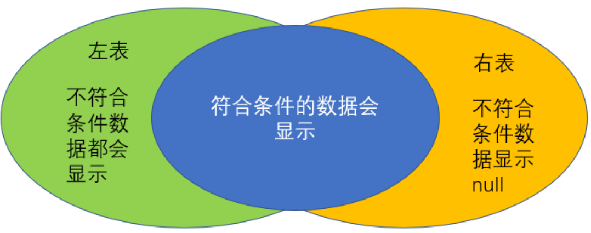

  右外连接：显示右表中所有的数据及左表中符合条件的数据，左表中不符合条件的数据为null。

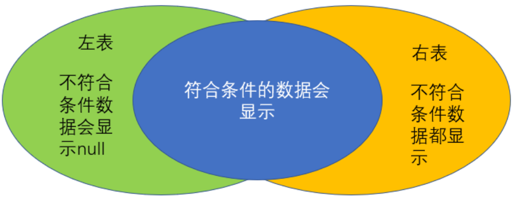

    MySQL中不支持全外连接。

- 内连接：只显示符合条件的数据

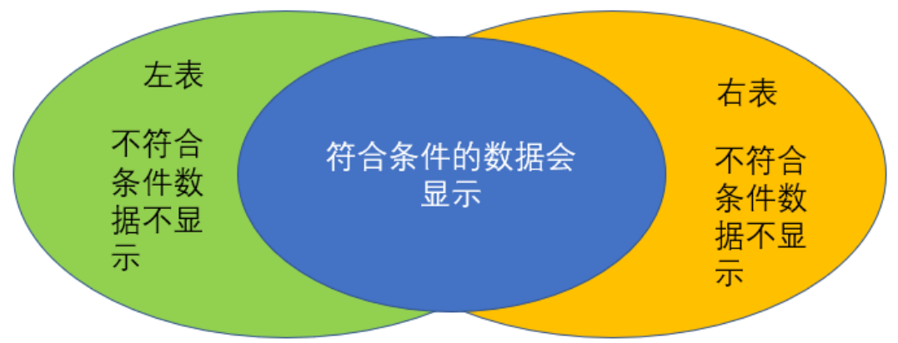

- 交叉连接：使用笛卡尔积的一种连接。
  笛卡尔积，百度百科的解释：两个集合X和Y的笛卡尔积表示为X × Y，第一个对象是X的成员而第二个对象是Y的所有可能有序对的其中一个成员 。例如：A={a,b}，B={0,1,2}，A × B = {(a,0)，(a,1)， (a,2)，(b,0)，(b,1)，(b,2)}
  举例如下：有两张表分为L表和R表。
  L表

|  A   |  B   |
| :--: | :--: |
|  a1  |  b1  |
|  a2  |  b2  |
|  a3  |  b3  |

R表

|  B   |  C   |
| :--: | :--: |
|  b1  |  c1  |
|  b2  |  c2  |
|  b4  |  c3  |

- 左外连接 ： `select L.* , R.* from L left join R on L.b=R.b`

|  A   |  B   |  B   |  C   |
| :--: | :--: | :--: | :--: |
|  a1  |  b1  |  b1  |  c1  |
|  a2  |  b2  |  b2  |  c2  |
|  a3  |  b3  | null | null |

- 右外连接： `select L.*,R.* from L right join R on L.b=R.b`

|  B   |  C   |  A   |  B   |
| :--: | :--: | :--: | :--: |
|  b1  |  c1  |  a1  |  b1  |
|  b2  |  c2  |  a2  |  b2  |
|  b4  |  c3  | null | null |

- 内连接： `select L.*,R.* from L inner join R on L.b=R.b`

| A    | B    | B    | C    |
| ---- | ---- | ---- | ---- |
| a1   | b1   | b1   | c1   |
| a2   | b2   | b2   | c2   |

- 交叉连接： `select L.*,R.* from L,R`

| A    | B    | B    | C    |
| ---- | ---- | ---- | ---- |
| a1   | b1   | b1   | c1   |
| a1   | b1   | b2   | c2   |
| a1   | b1   | b4   | c3   |
| a2   | b2   | b1   | c1   |
| a2   | b2   | b2   | c2   |
| a2   | b2   | b4   | c3   |
| a3   | b3   | b1   | c1   |
| a3   | b3   | b2   | c2   |
| a3   | b3   | b4   | c3   |

### mysql中in和exists的区别？　＊＊

in和exists一般用于子查询。

- 使用exists时会先进行外表查询，将查询到的每行数据带入到内表查询中看是否满足条件；使用in一般会先进行内表查询获取结果集，然后对外表查询匹配结果集，返回数据。
- in在内表查询或者外表查询过程中都会用到索引。
- exists仅在内表查询时会用到索引
- 一般来说，当子查询的结果集比较大，外表较小使用exist效率更高；当子查询的结果集较小，外表较大时，使用in效率更高。
- 对于not in和not exists，not exists效率比not in的效率高，与子查询的结果集无关，因为not in对于内外表都进行了全表扫描，没有使用到索引。not exists的子查询中可以用到表上的索引。

### varchar和char的区别？　＊＊＊

- varchar表示变长，char表示长度固定。当所插入的字符超过他们的长度时，在严格模式下，会拒绝插入并提示错误信息，在一般模式下，会截取后插入。如char(5)，无论插入的字符长度是多少，长度都是5，插入字符长度小于5，则用空格补充。对于varchar(5)，如果插入的字符长度小于5，则存储的字符长度就是插入字符的长度，不会填充。
- 存储容量不同，对于char来说，最多能存放的字符个数为255。对于varchar，最多能存放的字符个数是65532。
  存储速度不同，char长度固定，存储速度会比varchar快一些，但在空间上会占用额外的空间，属于一种空间换时间的策略。而varchar空间利用率会高些，但存储速度慢，属于一种时间换空间的策略。

### MySQL中int(10)和char(10)和varchar(10)的区别？　＊＊＊

int(10)中的10表示的是显示数据的长度，而char(10)和varchar(10)表示的是存储数据的大小。

### drop、delete和truncate的区别？　＊＊

|           | drop                               | delete                               | truncate                     |
| --------- | ---------------------------------- | ------------------------------------ | ---------------------------- |
| 速度      | 快                                 | 逐行删除，慢                         | 较快                         |
| 类型      | DDL                                | DML                                  | DDL                          |
| 回滚      | 不可回滚                           | 可回滚                               | 不可回滚                     |
| 删除 内容 | 删除整个表，数据行、索引都会被删除 | 表结构还在，删除表的一部分或全部数据 | 表结构还在，删除表的全部数据 |

一般来讲，删除整个表，使用drop，删除表的部分数据使用delete，保留表结构删除表的全部数据使用 truncate

### UNION和UNION ALL的区别？　＊＊

union和union all的作用都是将两个结果集合并到一起。

- union会对结果去重并排序，union all直接直接返回合并后的结果，不去重也不进行排序。
- union all的性能比union性能好。

### 什么是临时表，什么时候会使用到临时表，什么时候删除临时表？　＊

MySQL在执行SQL语句的时候会临时创建一些存储中间结果集的表，这种表被称为临时表，临时表只对当前连接可见，在连接关闭后，临时表会被删除并释放空间。

临时表主要分为内存临时表和磁盘临时表两种。内存临时表使用的是MEMORY存储引擎，磁盘临时表使用的是MyISAM存储引擎。
一般在以下几种情况中会使用到临时表：

- FROM中的子查询
- DISTINCT查询并加上ORDER BY
- ORDER BY和GROUP BY的子句不一样时会产生临时表
- 使用UNION查询会产生临时表

### 大表数据查询如何进行优化？　＊＊＊

- 索引优化
- SQL语句优化
- 水平拆分
- 垂直拆分
- 建立中间表
- 使用缓存技术
- 固定长度的表访问起来更快
- 越小的列访问越快

### 了解慢日志查询吗？统计过慢查询吗？对慢查询如何优化？　＊＊＊

慢查询一般用于记录执行时间超过某个临界值的SQL语句的日志。

相关参数：

- slow_query_log：是否开启慢日志查询，1表示开启，0表示关闭。
- slow_query_log_file：MySQL数据库慢查询日志存储路径。
- long_query_time：慢查询阈值，当SQL语句查询时间大于阈值，会被记录在日志上。
- log_queries_not_using_indexes：未使用索引的查询会被记录到慢查询日志中。
- log_output：日志存储方式。“FILE”表示将日志存入文件。“TABLE”表示将日志存入数据库。

> 如何对慢查询进行优化？

- 分析语句的执行计划，查看SQL语句的索引是否命中
- 优化数据库的结构，将字段很多的表分解成多个表，或者考虑建立中间表。
- 优化LIMIT分页

### Explain

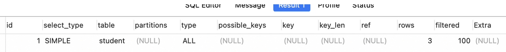

#### id

id这一列代表sql语句执行的顺序，id值越大的行，越先执行，id值相同的情况下，执行顺序就从上往下执行。一般来说，有多少个select，就会有多少个id。

#### select_type

这个从字面意思来看呢。就是查询类型，它主要就是来区别普通查询、联合查询、子查询等。

他有六种类型：

1. Simple：简单查询，查询不包含子查询和union

   explain SELECT * from student：可以看到，这个sql的explain执行计划上的select_type就是simple

   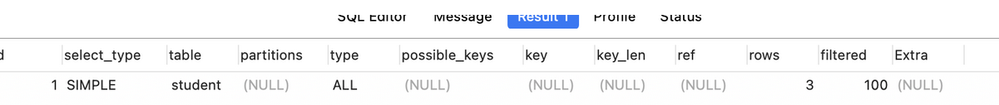

2. Primary：对于union、union all、子查询的大查询，最左侧的就是primary，复杂查询中最外层的select

   explain SELECT * from student union select * from student

3. Derived：包含在from子句中的子查询，MySQL会将结果存放在一个临时表中，也称为派生表

   explain SELECT * from (SELECT s1.* from student s1 union SELECT s2.* from student s2) k

4. Union：在union中的第二个和随后的select（）

   其实3、4、5可以使用同一条sql

5. Union result：从union临时表检索结果的select

6. Subquery：包含在select中的子查询(不在from子句中)，select查的字段中的信息。

   explain SELECT student.*,(SELECT name from student where name=‘name1’) from student where name=‘name1’

#### table

这个就是当前行所执行的表，当然了，如果表定义了别名的话，那么就会显示别名。

#### Partitions

分区，也就是查询的表所在的分区，如果是NULL的话，就代表该表没有被设置分区。

#### type

该行查询所使用的访问类型，他的值有十多种，但是这些我们没有必要全部知道，这里我列出来最常见的八种，这八种类型的效率就代表从好到差：

1. System:这个是效率最高的，比如像where  id=xxxx，但是在这里有个点我要说一下，就是啥吧，在MySQL5.7版本之前使用这类sql是可以出现System类型的，但是在5.7版本之后呢，就不会出现这个System类型了，转而是以Const类型来替代，也就是下面这种。

2. Const：mysql能对查询部分进行优化并将其转化为常量，用于primary key或者unique key的所有列与常数比较时，所以表最多只有一个匹配行，读取一次，速度比较快，

   对primary key或者unique key字段进行的查询，就是const

   select * from (select *from film where id=1)tmp;

3. eq_ref：primary key或者unique key索引的所有部分被连接使用，最多只会返回一条符合条件的记录，这是在const之外最好的连接类型了，简单的select查询不会出现这种type

   使用join进行连表查询时，对unique key或者primary key字段进行关联条件

   explain SELECT * from student left join project on student.project_id=project.id

4. Ref：代表在非唯一性索引或者非主键上进行的查询。

   EXPLAIN SELECT * from student where name=‘name1’

5. Ref_or_null，与上面类似，但是可以搜索值为null的行

   EXPLAIN SELECT * from student where name=‘namepro’ or name is null

6. Range：范围扫描，一般在in、between、>、<、>=等情况下使用，使用一个索引来检索给定范围的行。

   EXPLAIN SELECT * from student where id>1

7. Index：即使全表扫描，我们在表中也设置有主键索引，此时会走索引，

   select count(*) from student

8. All：全表扫描

   EXPLAIN SELECT * from student

   一般保证查询至少达到range级别，最好能达到ref。

#### possible_keys

表示该行查询可能使用到的查询索引，它是理论上的，某些情况下，是与实际用的索引不同的。

#### key

上面是可能使用到的索引，而这个呢，就是该行实际使用到的索引。

#### key len

表示索引中所使用的字节数，可通过该列计算查询中使用的索引长度。在不损失精确性的情况下，长度越短越好。key_len显示的值为索引字段的最大可能长度，并非实际使用长度，即key_len是根据表定义计算而得，并不是通过表内检索出的。

##### ref

显示关联的字段。如果使用常数等值查询，则显示const，如果是连接查询，则会显示关联的字段。

#### rows

rows列代表该行查询所涉及到多少行数据，而非最终的结果。

#### Filered

这个是个百分比，rows * filtered的值与前表产生交互，比如rows是1000，filtered是10,那么就说明会有10000 * 0.1=100的值与前表交互，

返回结果的行数占查询的行数的比例

explain SELECT * from student where id=‘1’

#### Extra

这一列展示的是额外信息。

Using index：表示使用索引，但是select的字段需要设置索引，如果有order by的话，那么order by里面的字段也要设置了索引。

explain select name from student order by name

Using where：使用where语句。

explain select * from student where id > 1;

Using temporary：使用临时表

explain select distinct project_id from student；这种就是Using  temporary，因为表中没有distinct  project_id这种字段，因此是先建立个临时表，然后对这个临时表来进行去重，这种一般是需要优化的，首先可以使用索引来进行优化。

Using filesort：采用文件扫描对结果进行计算排序，效率很差，对于排序，只有select字段与order by字段都被覆盖的话，才允许使用Using index

Explain select * from student order by name（Using filesort）

#### 总结

以上呢就是关于MySQL的explain执行计划的内容了，虽然他的显示出来的字段是比较多的，但是其实它是有的是重要的，有的则是不那么重要，因此我们其实是没有必要每一列都要彻底搞清楚的。

相对重要的属性：id、type、key、ref、extra。如果需要对sql进行优化的话，着重关注这几个就可以。


### SQL调优过程


### 为什么要设置主键？　＊＊

主键是唯一区分表中每一行的唯一标识，如果没有主键，更新或者删除表中特定的行会很困难，因为不能唯一准确地标识某一行。

### 主键一般用自增ID还是UUID？　＊＊

#### 自增ID

> 使用自增ID的好处

- 字段长度较uuid会小很多。
- 数据库自动编号，按顺序存放，利于检索
- 无需担心主键重复问题

> 使用自增ID的缺点

- 因为是自增，在某些业务场景下，容易被其他人查到业务量。
- 发生数据迁移时，或者表合并时会非常麻烦
- 在高并发的场景下，竞争自增锁会降低数据库的吞吐能力

#### UUID

通用唯一标识码，UUID是基于当前时间、计数器和硬件标识等数据计算生成的。

> 使用UUID的优点

- 唯一标识，不会考虑重复问题，在数据拆分、合并时也能达到全局的唯一性。
- 可以在应用层生成，提高数据库的吞吐能力。
- 无需担心业务量泄露的问题。

> 使用UUID的缺点

- 因为UUID是随机生成的，所以会发生随机IO，影响插入速度，并且会造成硬盘的使用率较低。
- UUID占用空间较大，建立的索引越多，造成的影响越大。
- UUID之间比较大小较自增ID慢不少，影响查询速度。

<hr>


最后说下结论，一般情况MySQL推荐使用自增ID。因为在MySQL的InnoDB存储引擎中，主键索引是一种聚簇索引，主键索引的B+树的叶子节点按照顺序存储了主键值及数据，如果主键索引是自增ID，只需要按顺序往后排列即可，如果是UUID，ID是随机生成的，在数据插入时会造成大量的数据移动，产生大量的内存碎片，造成插入性能的下降。

#### SnowFlake 雪花算法

SnowFlake 中文意思为雪花，故称为雪花算法。最早是 Twitter 公司在其内部用于分布式环境下生成唯一 ID。在2014年开源 scala 语言版本。

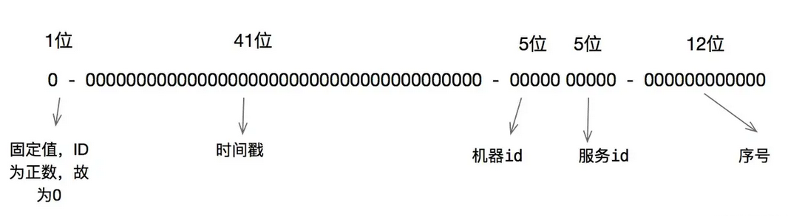

雪花算法的原理就是生成一个的 64 位比特位的 long 类型的唯一 id。

- 最高 1 位固定值 0，因为生成的 id 是正整数，如果是 1 就是负数了。
- 接下来 41 位存储毫秒级时间戳，2^41/(1000 * 60 * 60 * 24 * 365)=69，大概可以使用 69 年。
- 再接下 10 位存储机器码，包括 5 位 datacenterId 和 5 位 workerId。最多可以部署 2^10=1024 台机器。
- 最后 12 位存储序列号。同一毫秒时间戳时，通过这个递增的序列号来区分。即对于同一台机器而言，同一毫秒时间戳下，可以生成 2^12=4096 个不重复 id。

可以将雪花算法作为一个单独的服务进行部署，然后需要全局唯一 id 的系统，请求雪花算法服务获取 id 即可。

对于每一个雪花算法服务，需要先指定 10 位的机器码，这个根据自身业务进行设定即可。例如机房号+机器号，机器号+服务号，或者是其他可区别标识的 10 位比特位的整数值都行。

> 实现

```java
package util;
 
import java.util.Date;
 
/**
 * @Author: zjz
 */
public class SnowFlakeUtil {
 
    private static SnowFlakeUtil snowFlakeUtil;
    static {
        snowFlakeUtil = new SnowFlakeUtil();
    }
 
    // 初始时间戳(纪年)，可用雪花算法服务上线时间戳的值
    // 1650789964886：2022-04-24 16:45:59
    private static final long INIT_EPOCH = 1650789964886L;
 
    // 时间位取&
    private static final long TIME_BIT = 0b1111111111111111111111111111111111111111110000000000000000000000L;
 
    // 记录最后使用的毫秒时间戳，主要用于判断是否同一毫秒，以及用于服务器时钟回拨判断
    private long lastTimeMillis = -1L;
 
    // dataCenterId占用的位数
    private static final long DATA_CENTER_ID_BITS = 5L;
 
    // dataCenterId占用5个比特位，最大值31
    // 0000000000000000000000000000000000000000000000000000000000011111
    private static final long MAX_DATA_CENTER_ID = ~(-1L << DATA_CENTER_ID_BITS);
 
    // dataCenterId
    private long dataCenterId;
 
    // workId占用的位数
    private static final long WORKER_ID_BITS = 5L;
 
    // workId占用5个比特位，最大值31
    // 0000000000000000000000000000000000000000000000000000000000011111
    private static final long MAX_WORKER_ID = ~(-1L << WORKER_ID_BITS);
 
    // workId
    private long workerId;
 
    // 最后12位，代表每毫秒内可产生最大序列号，即 2^12 - 1 = 4095
    private static final long SEQUENCE_BITS = 12L;
 
    // 掩码（最低12位为1，高位都为0），主要用于与自增后的序列号进行位与，如果值为0，则代表自增后的序列号超过了4095
    // 0000000000000000000000000000000000000000000000000000111111111111
    private static final long SEQUENCE_MASK = ~(-1L << SEQUENCE_BITS);
 
    // 同一毫秒内的最新序号，最大值可为 2^12 - 1 = 4095
    private long sequence;
 
    // workId位需要左移的位数 12
    private static final long WORK_ID_SHIFT = SEQUENCE_BITS;
 
    // dataCenterId位需要左移的位数 12+5
    private static final long DATA_CENTER_ID_SHIFT = SEQUENCE_BITS + WORKER_ID_BITS;
 
    // 时间戳需要左移的位数 12+5+5
    private static final long TIMESTAMP_SHIFT = SEQUENCE_BITS + WORKER_ID_BITS + DATA_CENTER_ID_BITS;
 
    /**
     * 无参构造
     */
    public SnowFlakeUtil() {
        this(1, 1);
    }
 
    /**
     * 有参构造
     * @param dataCenterId
     * @param workerId
     */
    public SnowFlakeUtil(long dataCenterId, long workerId) {
        // 检查dataCenterId的合法值
        if (dataCenterId < 0 || dataCenterId > MAX_DATA_CENTER_ID) {
            throw new IllegalArgumentException(
                    String.format("dataCenterId 值必须大于 0 并且小于 %d", MAX_DATA_CENTER_ID));
        }
        // 检查workId的合法值
        if (workerId < 0 || workerId > MAX_WORKER_ID) {
            throw new IllegalArgumentException(String.format("workId 值必须大于 0 并且小于 %d", MAX_WORKER_ID));
        }
        this.workerId = workerId;
        this.dataCenterId = dataCenterId;
    }
 
    /**
     * 获取唯一ID
     * @return
     */
    public static Long getSnowFlakeId() {
        return snowFlakeUtil.nextId();
    }
 
    /**
     * 通过雪花算法生成下一个id，注意这里使用synchronized同步
     * @return 唯一id
     */
    public synchronized long nextId() {
        long currentTimeMillis = System.currentTimeMillis();
        System.out.println(currentTimeMillis);
        // 当前时间小于上一次生成id使用的时间，可能出现服务器时钟回拨问题
        if (currentTimeMillis < lastTimeMillis) {
            throw new RuntimeException(
                    String.format("可能出现服务器时钟回拨问题，请检查服务器时间。当前服务器时间戳：%d，上一次使用时间戳：%d", currentTimeMillis,
                            lastTimeMillis));
        }
        if (currentTimeMillis == lastTimeMillis) {
            // 还是在同一毫秒内，则将序列号递增1，序列号最大值为4095
            // 序列号的最大值是4095，使用掩码（最低12位为1，高位都为0）进行位与运行后如果值为0，则自增后的序列号超过了4095
            // 那么就使用新的时间戳
            sequence = (sequence + 1) & SEQUENCE_MASK;
            if (sequence == 0) {
                currentTimeMillis = getNextMillis(lastTimeMillis);
            }
        } else { // 不在同一毫秒内，则序列号重新从0开始，序列号最大值为4095
            sequence = 0;
        }
        // 记录最后一次使用的毫秒时间戳
        lastTimeMillis = currentTimeMillis;
        // 核心算法，将不同部分的数值移动到指定的位置，然后进行或运行
        // <<：左移运算符, 1 << 2 即将二进制的 1 扩大 2^2 倍
        // |：位或运算符, 是把某两个数中, 只要其中一个的某一位为1, 则结果的该位就为1
        // 优先级：<< > |
        return
                // 时间戳部分
                ((currentTimeMillis - INIT_EPOCH) << TIMESTAMP_SHIFT)
                // 数据中心部分
                | (dataCenterId << DATA_CENTER_ID_SHIFT)
                // 机器表示部分
                | (workerId << WORK_ID_SHIFT)
                // 序列号部分
                | sequence;
    }
 
    /**
     * 获取指定时间戳的接下来的时间戳，也可以说是下一毫秒
     * @param lastTimeMillis 指定毫秒时间戳
     * @return 时间戳
     */
    private long getNextMillis(long lastTimeMillis) {
        long currentTimeMillis = System.currentTimeMillis();
        while (currentTimeMillis <= lastTimeMillis) {
            currentTimeMillis = System.currentTimeMillis();
        }
        return currentTimeMillis;
    }
 
    /**
     * 获取随机字符串,length=13
     * @return
     */
    public static String getRandomStr() {
        return Long.toString(getSnowFlakeId(), Character.MAX_RADIX);
    }
 
    /**
     * 从ID中获取时间
     * @param id 由此类生成的ID
     * @return
     */
    public static Date getTimeBySnowFlakeId(long id) {
        return new Date(((TIME_BIT & id) >> 22) + INIT_EPOCH);
    }
 
    public static void main(String[] args) {
        SnowFlakeUtil snowFlakeUtil = new SnowFlakeUtil();
        long id = snowFlakeUtil.nextId();
        System.out.println(id);
        Date date = SnowFlakeUtil.getTimeBySnowFlakeId(id);
        System.out.println(date);
        long time = date.getTime();
        System.out.println(time);
        System.out.println(getRandomStr());
 
    }
 
}
```

### 字段为什么要设置成not null?　＊＊

首先说一点，NULL和空值是不一样的，空值是不占用空间的，而NULL是占用空间的，所以字段设为 NOT NULL后仍然可以插入空值。

字段设置成not null主要有以下几点原因：

- NULL值会影响一些函数的统计，如count，遇到NULL值，这条记录不会统计在内。
- B树不存储NULL，所以索引用不到NULL，会造成第一点中说的统计不到的问题。
- NOT IN子查询在有NULL值的情况下返回的结果都是空值

例如user表如下

|  id  | username |
| :--: | :------: |
|  0   | zhangsan |
|  1   |   lisi   |
|  2   |   null   |

`select * from user where username NOT IN (select username from user where id != 0)` ，这条查询语句应该查到zhangsan这条数据，但是结果显示为null。

- MySQL在进行比较的时候，NULL会参与字段的比较，因为NULL是一种比较特殊的数据类型，数据库在处理时需要进行特殊处理，增加了数据库处理记录的复杂性。

### 如何优化查询过程中的数据访问？　＊＊＊

从减少数据访问方面考虑：

- 正确使用索引，尽量做到索引覆盖
- 优化SQL执行计划

从返回更少的数据方面考虑：

- 数据分页处理
- 只返回需要的字段

从减少服务器CPU开销方面考虑：

- 合理使用排序
- 减少比较的操作
- 复杂运算在客户端处理

从增加资源方面考虑：

- 客户端多进程并行访问
- 数据库并行处理

### 如何优化长难的查询语句？　＊＊

- 将一个大的查询分解为多个小的查询
- 分解关联查询，使缓存的效率更高

### 如何优化LIMIT分页？　＊＊

- 在LIMIT偏移量较大的时候，查询效率会变低，可以记录每次取出的最大ID，下次查询时可以利用 ID 进行查询
- 建立复合索引

### 如何优化UNION查询　＊＊

如果不需要对结果集进行去重或者排序建议使用UNION ALL，会好一些。

### 如何优化WHERE子句　＊＊＊

- 不要在where子句中使用!=和<>进行不等于判断，这样会导致放弃索引进行全表扫描。
- 不要在where子句中使用null或空值判断，尽量设置字段为not null。
- 尽量使用union all代替or
- 在where和order by涉及的列建立索引
- 尽量减少使用in或者not in，会进行全表扫描
- 在where子句中使用参数会导致全表扫描
- 避免在where子句中对字段及进行表达式或者函数操作会导致存储引擎放弃索引进而全表扫描

### Select 0 / Select NULL / Select False

https://blog.csdn.net/qq_43589642/article/details/123264223

### SQL语句执行的很慢原因是什么？　＊＊＊

- 如果SQL语句只是偶尔执行很慢，可能是执行的时候遇到了锁，也可能是redo log日志写满了，要将redo log中的数据同步到磁盘中去。
- 如果SQL语句一直都很慢，可能是字段上没有索引或者字段有索引但是没用上索引。

### SQL语句的执行顺序?　＊

```mysql
SELECT DISTINCT
	select_list
FROM
	left_table
LEFT JOIN
	right_table ON join_condition
WHERE
	where_condition
GROUP BY
    group_by_list
HAVING
	having_condition
ORDER BY
	order_by_condition
```

执行顺序如下：

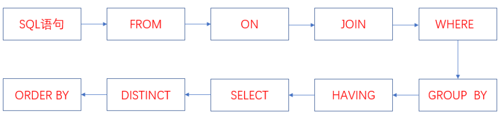

- FROM：对SQL语句执行查询时，首先对关键字两边的表以笛卡尔积的形式执行连接，并产生一个虚表V1。虚表就是视图，数据会来自多张表的执行结果。
- ON：对FROM连接的结果进行ON过滤,并创建虚表V2
- JOIN：将ON过滤后的左表添加进来，并创建新的虚拟表V3
- WHERE：对虚拟表V3进行WHERE筛选，创建虚拟表V4
- GROUP BY：对V4中的记录进行分组操作，创建虚拟表V5
- HAVING：对V5进行过滤，创建虚拟表V6
- SELECT：将V6中的结果按照SELECT进行筛选，创建虚拟表V7
- DISTINCT：对V7表中的结果进行去重操作，创建虚拟表V8，如果使用了GROUP BY子句则无需使用DISTINCT，因为分组的时候是将列中唯一的值分成一组，并且每组只返回一行记录，所以所有的记录都h是不同的。
- ORDER BY：对V8表中的结果进行排序。

### 如何优化 insert 的性能

1. 合并多条insert为一条 即: insert into t values(a,b,c), (d,e,f),
   原因分析:主要原因是多条insert合并后日志量(MySQL的binlog和innodb的事务日志)减少了，降低日志刷盘的数据量和频率，从而提高效率。通过合并SQL语句，同时也能减少SQL语句解析的次数，减少网络传输的I0。

2. 修改参数~~bulk_insert_buffer_size~~, 调大批量插入的缓存;

3. 设置~~innodb_flush_log_at_trx_commit~~ = 0 相对于~~innodb_flush_log_at_trx_commit~~ = 1可以十分明显的提升导入速度;
   ~~innodb_flush_log_at_trx_commit~~ 参数解释如下:
   0: log buffer中的数据将以每秒一次的频率写入到log file中，且同时会进行文件系统到磁盘的同步操作，但是每个事务的commit并不会触发任何log buffer 到log file的刷新或者文件系统到磁盘的刷新操作;
   1;在每次事务提交的时候将log buffer 中的数据都会写入到log file, 同时也会触发文件系统到磁盘的同步;
   2:事务提交会触发log buffer到log file的刷新，但并不会触发磁盘文件系统到磁盘的同步。此外，每秒会有一次文件系统到磁盘同步操作。

4. 手动使用事务

   Mysql 事务默认是 ~~autocommit~~ 的，所以可以手动提交事务，减少每个insert语句就创建一个事务带来的性能消耗。

   一般1000条insert提交一次事务，具体情况可以根据业务需求决定。

### 为什么建议 InnoDB 表必须建主键，并且推荐使用整型的自增主键？

> 为什么要建主键

InnoDB会根据主键建立索引树，如果没有指定主键，Mysql会找一列有唯一约束的列作为主键进行维护，如果再找不到，Mysql则会自己生成一列 `row_id`，通过 `row_id`, 作为唯一列维护 B+ 树的数。显然，要求 Mysql 生成列并通过这一列维护B+树，十分浪费Mysql的性能。因此尽量指定一列主键，以此减少Mysql的工作量。

> 为什么推荐用整型自增主键

整型:

- 比大小的速度相对 UUID 字符串类型来得快
- 比UUID这么长的字符串更加节省空间，因为 Mysql 在生产环境都是用 ssd 这种相对来说十分昂贵的高速固态硬盘，要更加节省空间的使用。

 自增：

- 可以直接在树的尾部添加结点，插入数据时不用在树中搜索一遍
- 在插入数据时，如果主键不是自增的，且该数据要插入的数据页正好存满了，需要新开一页，将原先页中最后的数据移动到新的这一页中，才能将新插入的数据放进正确的位置。这个过程比较浪费性能。一页的大小默认为 16kb

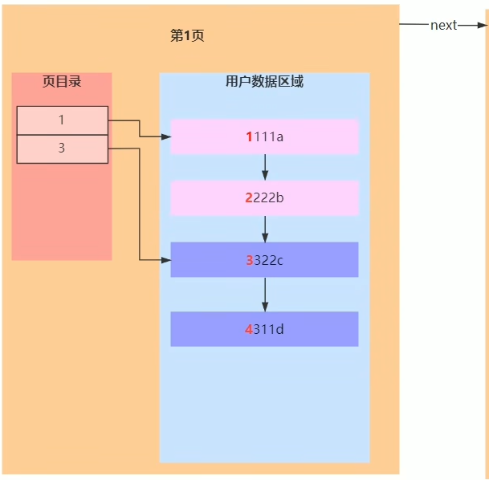

> 3层B+树能存多少数据？

```mysql
-- 表结构
create table test {
	a int,
	b int,
	c int,
	d int,
	e varchar(20)
}
```

假设主键为a字段，则索引页中每一组数据为 int + 指针 = 4b + 6b = 10b，则索引页中可以存放 16kb / 10 b = 1638 条数据

一页有16kb，假设一行数据1kb。

则一共可以存放 1638 * 1638 * 16 / 1kb = 42,928,704

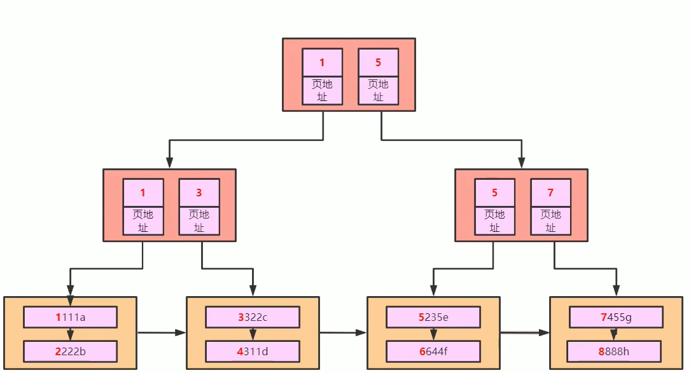

> 如果再创建一个 bcd 字段的索引

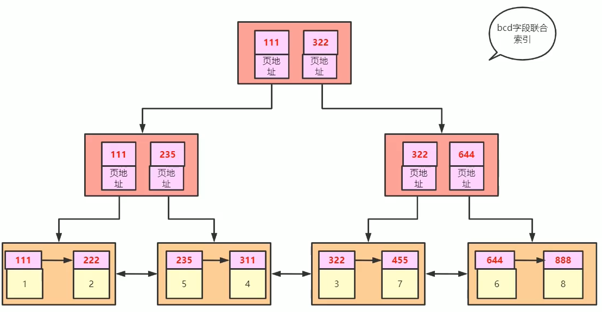

则数据区域存放的为主键的值，InnoDB获得主键后再回表通过主键索引去获取数据

### 什么是覆盖索引

表结构

```mysql
CREATE TABLE test (
    a INT PRIMARY KEY,
    b INT,
    c INT,
    d INT, 
    e VARCHAR(20)
) ENGINE=INNODB;

CREATE INDEX idx_test_bcd ON test(b,c,d); -- 创建索引
```

此时有两个索引，主键索引a，和后创建的联合索引 idx_test_bcd

如果执行sql

```mysql
SELECT b, c, d, a FROM test WHERE b = 1;
```

就可以发现，在索引 bcd中，已经存有了b, c, d字段，叶子结点数据为字段 a，所以直接在索引中抽取这四个字段的数据返回即可，这个过程称为覆盖索引。

### 索引扫描的一些情况

```mysql
EXPLAIN SELECT b FROM test;		-- 使用了 idx_test_bcd
EXPLAIN SELECT c FROM test;		-- 使用了 idx_test_bcd 
```

本质上是直接通过 bcd 索引**叶子结点存储的数据**进行扫描(此时不需要符合最左前缀原则)，这样加载进内存的数据要少于以主键为索引的数据量，可以节省空间，并且结果只需要 bcd 索引中的数据，所以使用 idx_test_bcd，可以节省空间和时间。

### 索引在什么情况下会失效？

在上面介绍了几种不符合最左匹配原则的情况会导致索引失效，除此之外，以下这几种情况也会导致索引失效。

- 条件中有or，例如 `select * from table_name where a = 1 or b = 3`   -> 用 union 优化
- 在索引上进行计算会导致索引失效，例如 `select * from table_name where a + 1 = 2`
- 在索引的类型上进行数据类型的隐形转换，会导致索引失效，例如字符串一定要加引号，假设 `select * from table_name where a = '1'` 会使用到索引，如果写成 `select * from table_name where a = 1` 则会导致索引失效。
- 在索引中使用函数会导致索引失效，例如 `select * from table_name where abs(a) = 1`
- 在使用like查询时以%开头会导致索引失效
- 索引上使用！、=、<>进行判断时会导致索引失效，例如 `select * from table_name where a != 1`
- 索引字段上使用 is null/is not null判断时会导致索引失效，例如 `select * from table_name where a is null`

## 数据库优化

### 大表如何优化？　＊＊＊

- 限定数据的范围：避免不带任何限制数据范围条件的查询语句。
- 读写分离：主库负责写，从库负责读。
- 垂直分表：将一个表按照字段分成多个表，每个表存储其中一部分字段。
- 水平分表：在同一个数据库内，把一个表的数据按照一定规则拆分到多个表中。
- 对单表进行优化：对表中的字段、索引、查询SQL进行优化。
- 添加缓存

### 什么是垂直分表、垂直分库、水平分表、水平分库？　＊＊＊

**垂直分表**：将一个表按照字段分成多个表，每个表存储其中一部分字段。一般会将常用的字段放到一个表中，将不常用的字段放到另一个表中。
垂直分表的优势：

- 避免IO竞争减少锁表的概率。因为大的字段效率更低，第一数据量大，需要的读取时间长。第二，大字段占用的空间更大，单页内存储的行数变少，会使得IO操作增多。
- 可以更好地提升热门数据的查询效率。

垂直分库：按照业务对表进行分类，部署到不同的数据库上面，不同的数据库可以放到不同的服务器上面。

垂直分库的优势

- 降低业务中的耦合，方便对不同的业务进行分级管理。
- 可以提升IO、数据库连接数、解决单机硬件资源的瓶颈问题。

垂直拆分（分库、分表）的缺点

- 主键出现冗余，需要管理冗余列
- 事务的处理变得复杂
- 仍然存在单表数据量过大的问题

**水平分表**：在同一个数据库内，把同一个表的数据按照一定规则拆分到多个表中。

水平分表的优势

- 解决了单表数据量过大的问题
- 避免IO竞争并减少锁表的概率

**水平分库**：把同一个表的数据按照一定规则拆分到不同的数据库中，不同的数据库可以放到不同的服务器上。

水平分库的优势：

- 解决了单库大数据量的瓶颈问题
- IO冲突减少，锁的竞争减少，某个数据库出现问题不影响其他数据库（可用性），提高了系统的稳定性和可用性

水平拆分（分表、分库）的缺点

- 分片事务一致性难以解决
- 跨节点JOIN性能差，逻辑会变得复杂
- 数据扩展难度大，不易维护

在系统设计时应根据业务耦合来确定垂直分库和垂直分表的方案，在数据访问压力不是特别大时应考虑缓存、读写分离等方法，若数据量很大，或持续增长可考虑水平分库分表，水平拆分所涉及的逻辑比较复杂，常见的方案有客户端架构和代理架构。

### 分库分表后，ID键如何处理？　＊＊＊

分库分表后不能每个表的ID都是从1开始，所以需要一个全局ID，设置全局ID主要有以下几种方法：

- UUID：优点：本地生成ID，不需要远程调用；全局唯一不重复。缺点：占用空间大，不适合作为索引。

- 数据库自增ID：在分库分表表后使用数据库自增ID，需要一个专门用于生成主键的库，每次服务接收到请求，先向这个库中插入一条没有意义的数据，获取一个数据库自增的ID，利用这个ID去分库分表中写数据。优点：简单易实现。缺点：在高并发下存在瓶颈。系统结构如下图（图片来源于网络）

  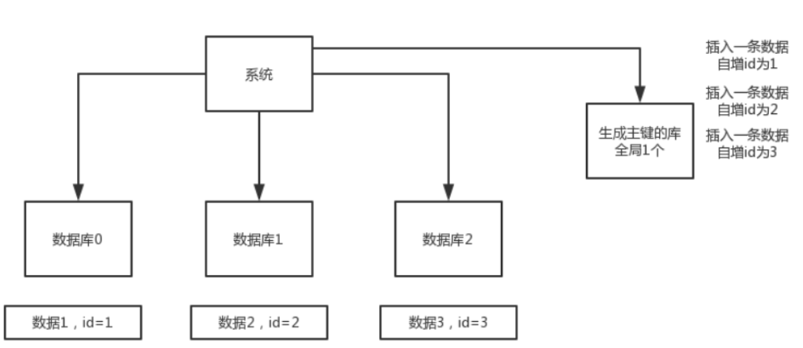

- Redis生成ID：优点：不依赖数据库，性能比较好。缺点：引入新的组件会使得系统复杂度增加

- Twitter的snowflake算法：是一个64位的long型的ID，其中有1bit是不用的，41bit作为毫秒数，
  10bit作为工作机器ID，12bit作为序列号。
  1bit：第一个bit默认为0，因为二进制中第一个bit为1的话为负数，但是ID不能为负数.
  41bit：表示的是时间戳，单位是毫秒。
  10bit：记录工作机器ID，其中5个bit表示机房ID，5个bit表示机器ID。
  12bit：用来记录同一毫秒内产生的不同ID。

- 美团的Leaf分布式ID生成系统，美团点评分布式ID生成系统

### MySQL的复制原理及流程？如何实现主从复制？　＊＊＊

MySQL复制：为保证主服务器和从服务器的数据一致性，在向主服务器插入数据后，从服务器会自动将主服务器中修改的数据同步过来。

主从复制的原理：

主从复制主要有三个线程：binlog线程，I/O线程，SQL线程。

- binlog线程：负责将主服务器上的数据更改写入到二进制日志（Binary log）中。
- I/O线程：负责从主服务器上读取二进制日志（Binary log），并写入从服务器的中继日志（Relay log）中。
- SQL线程：负责读取中继日志，解析出主服务器中已经执行的数据更改并在从服务器中重放复制过程如下（图片来源于网络）：

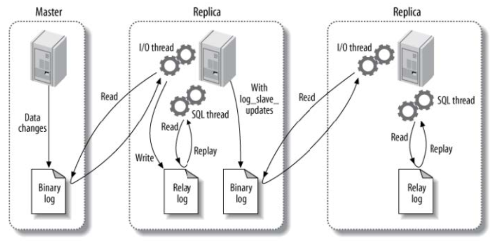

1. Master在每个事务更新数据完成之前，将操作记录写入到binlog中。
2. Slave从库连接Master主库，并且Master有多少个Slave就会创建多少个binlog dump线程。当Master节点的binlog发生变化时，binlog dump会通知所有的Slave，并将相应的binlog发送给Slave。
3. I/O线程接收到binlog内容后，将其写入到中继日志（Relay log）中。
4. SQL线程读取中继日志，并在从服务器中重放。

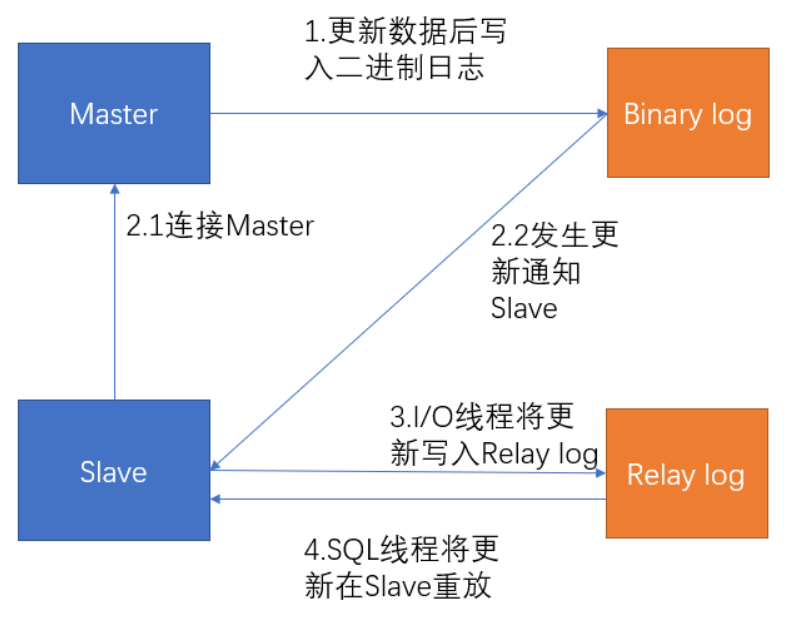

> 主从复制的作用

- 高可用和故障转移
- 负载均衡
- 数据备份
- 升级测试

### 了解读写分离吗？　＊＊＊

读写分离主要依赖于主从复制，主从复制为读写分离服务。

读写分离的优势：

- 主服务器负责写，从服务器负责读，缓解了锁的竞争
- 从服务器可以使用MyISAM，提升查询性能及节约系统开销
- 增加冗余，提高可用性